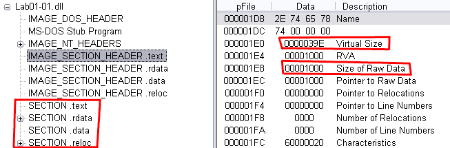
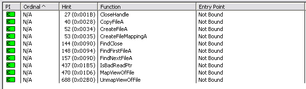
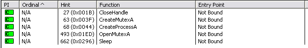
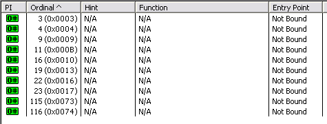
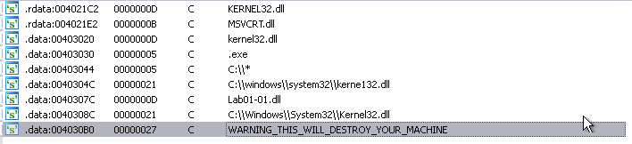
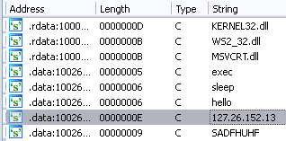

# Lab01-01

## Q1: Upload the files to http://www.VirusTotal.com/ and view the reports. Does either file match any existing antivirus signatures?

### Lab01-01.exe
The executable is recognized as a trojan by 54/72 vendors. 

The dll file is also labeled as a trojan by VirusTotal. This time 45 out of 72 vendors flagged it as malicious.

### Lab01-01.dll

## Q2: When were these files compiled?

### Lab01-01.exe
The executable was compiled 2010-12-19 at 16:16:19 UTC

### Lab01-01.dll
The dll was compiled 2010-12-19 at 16:16:38 UTC

## Q3: Are there any indications that either of these files is packed or obfuscated? If so, what are these indicators?

### Lab01-01.exe

The executable is very likely not packed. Because the section names are the expected ones. .text, .data, .rdata etc. And the .text sections virtual size and raw data size only differs with 48 bytes.

The executables .rdata and .data sections takes up less space in memory (Virtual Size) than it does on disk (Raw Data Size). .radata uses 690 bytes when loaded and .data uses 3844 bytes when loaded.

### Lab01-01.dll

The dll' file is likely not packed as the section names correspond to the expected standard. .text, .data, .rdata etc. The dll's .text section takes up less space in memory (Virtual Size = 926 bytes) while it takes up *more* space on disk (Raw Data Size = 4096 bytes).

It likely does not contains packed .rdata since its virtual size and raw data size only differ with 58 bytes.

The .data section like the .text section takes up less memory when loaded compared to what it uses on disk.

## Q4: Do any imports hint at what this malware does? If so, which imports are they?

### Lab01-01.exe

The executable depends on kernal32.dll, which contains core functionality for Windows. Such as memory, file and hardware manipulation. 

* CreateFile indicates that the program either creates or opens a handle to some kind of I/O (this could be a file on disk but doesnt' have to be). 

* CopyFile does what the name suggests and copies a file. 

* CreateFileMapping creates a handle to a file mapping object. MapViewOfFile then uses that handle to makes it possible to treat the contents of a file as an array with read and/or write access.

* UnmapViewOfFile and CloseHandle clears up the functionality of the previous functions.

* FindFirstFile begins a search for a file or subdirectory based on a name. FindNextFile continues this search to the next possible match. FindClose ends the search.

### Lab01-01.dll

The dll file utilizes kernal32.dll and WS2_32.dll. The last dll file is for socket and network manipulation. Which indicates that the dll file will try to establish some kind of network connection.

#### kernel32.dll
* CreateProcessA spawns a new independent process. This process will inherit the rights of the process that created it. I.e. if the creator has administartor rights, so will the new process. 
* CreateMutex/OpenMutex retrieves a handle to a mutex synchronization primitive.

#### WS2_32.dll
* Ordinal 4, connect - Uses a socket to establish an connection to a specific address.
* Ordinal 9, htons - Are used to convert an uint16 to TCP/IP endianess.
* Ordinal 11, inet_address - Converts a string containing an IPv4 address into a non string representation.
* Ordinal 16, recv - are used to recieve data over a connected socket.
* Ordinal 19, send - are used to send data over a connected socket.
* Ordinal 23, socket - Opens a socket to a specific "address family" (IPv4, NETBIOS, Bluetooth etc), and protocol (UDP/TCP/ICMP etc).

## Q5: Are there any other files or host-based indicators that you could look for on infected systems?

### Lab01-01.exe

The strings stored in the binary suggests that the executable interacts with the provided dll file somehow (considering the many file manipulation functions used). It may try to copy the dll file to C:\\. But further analysis is requried to know for sure.

The kerne132.dll file is not a name of an existing Windows dll and might be created by the executable. If so the filesystem could be searched for this dll file. If found its a sign of infection.

## Q6: What network-based indicators could be used to find this malware on infected machines?

### Lab01-01.dll

The strings stored in the dll file gives away the internet address that it tries to connect to. Indicators of infection can be seen in network traffic if connections are made to 127.26.152.13 (but this IP is not real as localhost is reserved for 127.0.0.1/8).

## Q7: What would you guess is the purpose of these files?

### Lab01-01.exe
Based on the many file manipulation functions it is safe to assume that CreateFile opens a handle to a file. Either to an existing file or by creating a new file. The program also triggers a search, this could be for the directory that it tries to copy some file into. But it could also be a serach for the malicious dll file (whos name exist as a string literal in the binary). Further analysis is required to know for sure what it searches for.

The program also accesses the content of a file by openeing a file mapping object. Whether or not this is just to read it or to write to it can't be known without further analysis.

Considering that the binary contains the string literal of kerne132.dll it might be trying to create its own version of kernel32.dll.

### Lab01-01.dll

The DLL likely creates a new process (using CreateProcessA) as well as a Mutex (using CreateMutexA) that it will use to synchronize between the original process and the newly created one. The spawned process will try to establish an internet connection to 127.26.152.13 (by creating a socket using Ordinal 23 and opening a connection using Ordinal 4, connect). This is a IPv4 connection (based on Ordinal 11 (inet_address) and 9 (htons) and the string literal containing the IP). This connection will both send and recieve data (using Ordinal 16 (recv) and 19 (send)). 

The string literals "hello", "sleep" and "exec" could be commands that are sent over the connection. Which would make this a kind of Command and Control malware.