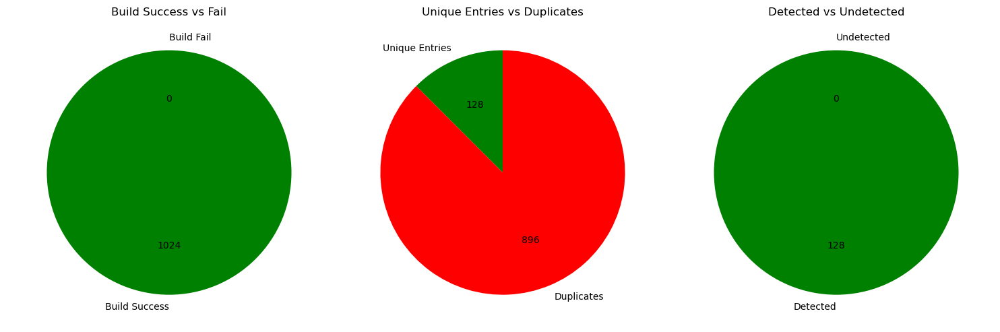
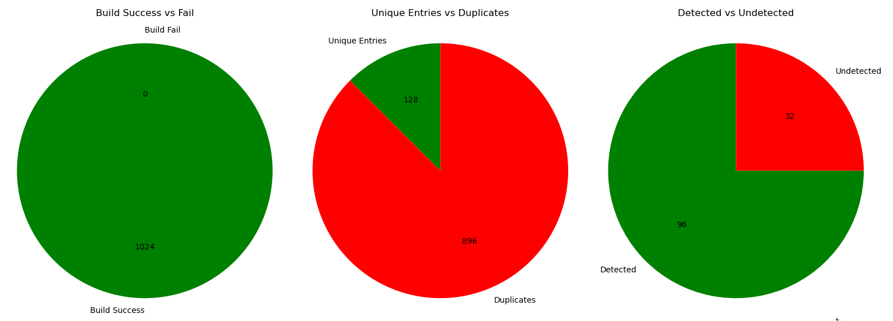

# Evading Static Detection with Compilation

## Abstract

Static detection techniques, such as heuristic analysis and machine learning, play a crucial role in malware detection. However, both of these techniques rely heavily on opcodes for detection. Thus, it may be possible to reduce the detection rate or evade these techniques with the help of the compiler alone. Using compilation flags to generate unique .text sections that are functionally identical. This study investigates to what extent the compiler can be used to bypass the static detection methods deployed by Windows Defender Antivirus. The experiment focuses only on compilergenerated variations without additional obfuscation techniques. The final results show that certain combinations of flags mutate the generated machine code enough to completely bypass detection. The findings indicate a potential oversight in static malware detection methodologies, which focus on overcoming obfuscation techniques and completely ignore compilation evasion

## Table of Contents

- [1. Introduction](#1-introduction)
- [2. Background](#2-background)
    - [2.1. TinyNuke Source Code](#21-tinynuke-source-code)
    - [2.2. Compilation Flags](#22-compilation-flags)
    - [2.3. Windows Defender Antivirus](#23-windows-defender-antivirus)
    - [2.4. Related Work](#24-related-work)
- [3. Method](#3-method)
    - [3.1. Environment](#31-environment)
    - [3.2. Compiler Flags](#32-compiler-flags)
    - [3.3. Set Assignment and Cartesian Product](#33-set-assignment-and-cartesian-product)
    - [3.4. Compilation Script](#34-compilation-script)
- [4. Results](#4-results)
- [5. Discussion](#5-discussion)
    - [5.1. Limitations](#51-limitations)
    - [5.2. Ethics](#52-ethics)
- [6. Conclusion](#6-conclusion)
    - [6.1. Future Work](#61-future-work)
- [References](#references)
- [Appendix A](#appendix-a)
- [Appendix B](#appendix-b)
- [Appendix C](#appendix-c)
- [Appendix D](#appendix-d)

## 1. Introduction

Malware continues to be a major problem, with an estimated 69 new variants of malware every 60 seconds [1]. Modern malware tend to employ polymorphic techniques in order to randomize its behaviour. This makes it possible for the malware to avoid detection of static signatures, such as hashes or byte patterns [2]. Over the years, antivirus solutions have improved their methods for static detection and they no longer rely solely on static signatures. One such additional technique is static heuristic detection, which works by inspecting a malware’s source code through decompilation. If a large enough percentage of that source code matches any entry in a heuristic database then that code will also be classified as a threat [3].

The fact that static heuristic analysis is performed on the final machine code instead of the higher level source code, can in theory be abused by a malware author. This is because native languages such as C and C++ use a compiler to generate that machine code. The compiler can be tweaked with various compilation flags that all have an impact on its final output. Using this, it is possible to create a combinatorial explosion of possible unique binaries. If the differences between binaries are large enough, it will avoid static detection. In that case, it may become a potent form of evasion that is trivial to execute by leveraging a build system like CMake to randomly generate a combination of compiler flags.


**RQ 1:** To what extent can known malware bypass detection with the help of compiler flags?


To answer the RQ, a quantitative study will be done. To ensure reliability, a script has been written in order to automate the compilation and antivirus scanning. Flags are chosen from those that have the potential to impact the final *.text* section. The chosen compiler flags are then divided into sets, which contain flags that are mutually exclusive. The script applies the Cartesian product to create a list of all possible flag combinations available, which it will use when compiling the binary variants.


The scope of the paper is limited to a single malware and a single antivirus solution. The malware that will be tested is TinyNuke. TinyNuke is one of the few real malware samples whose source code is publicly available [4], making it possible to recompile it with different combinations of compiler flags.


Furthermore, the number of antivirus solutions tested is limited to a single instance. That is, Windows Defender Antivirus. Windows Defender Antivirus was chosen because **a)** *TinyNuke is a Windows only malware* and **b)** *it comes pre-installed on Windows since Windows 10*, so it is available to all Windows users.


This paper aims to show whether compilation flags must be considered when developing static detection methods. Such as machine learning, which are highly dependent on N-grams and opcodes [5].

For example, in the paper [6], the author uses machine learning to fingerprint functions. The study takes into account obfuscation, different compilers, and different optimization flags. However, it ignores many other compiler flags that impact code generation. In Microsoft Visual C++ (MSVC) alone, it is easy to generate tens of thousands of different compiler flag combinations, as shown in Section II-B.

## 2. Background

*TinyNuke* is a banking trojan that first appeared in December 2016. However, *TinyNuke* failed to gain widespread adoption in cybercrime
circles. The main reason being that its author failed to gain their trust, as they believed that he was a scammer [7]. In a final attempt to regain the trust of the malware community and restore his reputation. The author posted on multiple forums a link to a GitHub repository that contained the source code for *TinyNuke* [7].

After its release, *TinyNuke* has seen a resurgence in malware campaigns. Particularly against French targets. *TinyNuke* was used extensively in 2018 and continued to be used in 2019 and 2020, although to a much lesser extent. In 2021 *TinyNuke* once again saw an increase in attacks, outpacing all previous years except 2018 [8].

### *2.1. TinyNuke Source Code*

*TinyNuke* is written for Windows using C and C++. The source code of the malware is managed by a Visual Studio (VS) solution and is intended to be built through VS itself or using msbuild. The VS solution contains two projects, one to build a DLL and one to build an executable [4].

The names of the projects in the VS solution and the created binary files are somewhat confusing. The project for the executable is called *Loader* and its produced executable is called *Bot.exe*. The VS project for the DLL is called Bot and the DLL file produced is called *int32.dll*
[4].

Before *TinyNuke* can be built, it must encrypt its strings. This is done by running the accompanying C# project, AutoEncrypt. This will encrypt strings such as IP addresses and function names that the malware resolves at runtime with the help of *GetProcAddress* [4].

### *2.2. Compilation Flags*

The MSVC documentation sorts compiler flags into categories, and the code generation category contains 67 unique flags [9]. It is true that some of these flags are mutually exclusive. Such as run-time checks (*/RTC1*) which cannot be used in combination with code optimization. There are still more than enough flags available to create a combinatorial explosion.

The optimization flags, */O1* and */O2*, are in reality a combination of multiple flags. For example */O2*, is the combination of */Og* (deprecated), */Oi*, */Ot*, */Oy* */Ob2*, */GF* and */Gy* [10]. Some of these can be turned on or off, others have different settings (*/Ob{0|1|2|3}*). These flags alone result in a total of 160 unique combinations.

On top of this, add the floating point flags */fp:fast*, */fp:except*, and */fp:strict*. Together with calling convention flags (*/Gd*, */Gr*, */Gv* and */Gz*) and security flags such as */Qspectre*, */Qspectre-load*, */Qspectre-load-cf*, */guard:cf*, */guard:cf-*, */GS*, and */GS-*. Brings the number of possible combinations to a whopping 30, 720. This is done by listing only a portion of the available flags. See Appendix C for an example of how floating point flags and security flags can impact the generated assembly code.

### *2.3. Windows Defender Antivirus*

Starting with Windows 10, Microsoft has shipped its own antivirus solution with Windows, namely Windows Defender Antivirus. Microsoft Defender Antivirus aims to identify anomalies, which is a step up from traditional signature-based detection that only looks for a specific byte pattern. A technique Microsoft stopped relying on back in 2015 [11]. Microsoft Defender Antivirus is fully aware of *TinyNuke* and will recognize both its DLL and executable as *TrojanSpy:Win32/Tinukebot.gen!bit* if stored on the computer [12].

Windows Defender Antivirus relies on a layered approach when scanning a suspicious file. The layers are sorted by performance, with the fastest detection methods at the top layers. This allows for fast detection in the majority of cases, as most malware is detected here. But if they are not, Windows Defender Antivirus can still employ slower and more advanced forms of detection techniques in the lower layers [13].

In practice, this means that the majority of file scans are inspected locally by the Windows Defender Antivirus client. In these cases Windows Defender Antivirus has access to machine learning models (binary and multi-class), generic and heuristic classifications, etc. If the local client is not enough, then the deeper layers of Windows Defender Antivirus will leverage cloud-based protection [13]. Because it is a propitiatory software, the exact details of its algorithms are poorly documented. Instead, this will have to be assumed to work as explained in the academic literature.

### *2.4. Related Work*

Heuristic detection is a combination of signature and behaviour based detection methods. It uses data mining and machine learning to try and identify behaviours and signatures. Unlike behaviour based detection, it does not execute the malicious file. Instead, it examines features such as API calls, N-grams, opcodes, etc [14]. Heuristic detection is dependent on the use of rules for a large part of its decision making. This requires a human with enough experience and time to manually create them [5].

There is a big overlap in features between heuristic and machine learning classification models. As they too rely on e.g. opcodes and N-grams [15] to train the model. In fact, using opcodes from the .text section is the attribute most used when performing static analysis. For behaviour analysis, it is a similar story, as it remains one of the most common attributes [5].

Relying on a single opcode results in poor detection for text classification models. This is the reason why malware detection models commonly employ techniques such as N-grams, which means that adjacent opcodes are also taken into account [5].

Obfuscation techniques like dead code insertion or instruction reordering can be seen in malware that updates their signatures without mutating their functionality. Furthermore, [1] found that over 50% of newly detected malware instances are in fact versions of older ones. This is supported by the fact that mutating a malware’s characteristics causes low detection rates in classification models that rely on signatures, sequences, or frequencies, as asserted by the paper [5].

However, mutating the opcodes of a binary’s .text section does not require traditional obfuscation techniques. Yet, scientific papers exploring the potential impact of binary variations created through compiler flags are surprisingly absent. Especially considering the reliance of N-grams to extract opcodes, which can change drastically with different compiler flags as shown in Appendix C.

## 3. Method

The experiment is a quantitative study with two independent variables, a mediating variable, a control variable, and a dependent variable, as explained by [16], [17]. The first independent variable is the source code of *TinyNuke*. This is constant and will not change throughout the experiment. The second is the sets of compilation flags, these are picked manually based on three criteria as explained in Section III-B.

Together, the two independent variables are used to create a mediating variable: the compiled binary (Portable Executable) file. The binary file is then scanned by Windows Defender Antivirus to obtain the detection result, which serves as the dependent variable. The *.text* section of the binary file is hashed by SHA-256. When enumerating the results, the hash value is used as a control variable to ensure that each *.text* section is counted only once. Both the scan result and the corresponding hash are stored in a CSV file containing all recorded data.

### *3.1. Environment*

The experiment was done on a virtual machine (VM) using VirtualBox and running Windows 11. The VM had initial internet access in order to download the required tools and update Windows Defender. Once everything was downloaded, the VM’s internet access was cut by removing its network adapter from the VM settings. For a complete list of software versions, see Appendix B.

### *3.2. Compiler Flags*

Three criteria were used when choosing the compiler flags. Namely, **a)** *Likely to have an impact on the generated code*, **b)** *Available for x86* and **c)** *Not require changes to the source code*.

Four flags can immediately be eliminated since they require changes to the source code, namely */Gr*, */Gv* and */Gz*, and */fsanitize-coverage=*. The latter requires user-defined functions to take effect, while the first three flags cause the compilation to fail and would require source code changes to compile successfully.

Next up for elimination are compiler flags that depend on keyword(s) that are missing from the solution. The */GR* flag enables Runtime Type Information and enables the use of **dynamic cast** and **typeid**. Since these keywords cannot be found when searching the solution using Visual Studio’s search functionality, it is eliminated.

For the same reason */GT* can be eliminated. It requires data that has been declared with **__declspec(thread)**. Since no such declaration exists, the flag is eliminated. Finally, the exception handling flags */EHascr* can also be eliminated, since the solution does not contain the keyword ’throw’.

The flags that did make the cut are */fp:strict*, */fp:fast*, */fp:precise*, */Qsafe_fp_loads*, as the solution uses the datatype **double** and therefore they could impact the generated assembly. */Qpar* tries to automatically parallelize loops. Because the source code contains for loops, it may affect the final machine code. */QIntel-jcc-erratum* may insert **NOP** padding next to conditional jumps, which exist in all but the most trivial programs and can therefore affect the generated code.

*/GS* inserts security cookies to detect buffer overruns and because the solution contains fixed sized C arrays, it may impact code generation. */Qspectre*, */Qspectre-load-cf* and */Qspectre-load* inserts synchronization primitives such as the **lfence** to counter speculative execution exploits. */Gs0* inserts a stack probe for every function that allocates stack memory. This makes it very likely to impact code generation for noninlined functions. */guard:cf* inserts a security check at each indirect call, on which the malware relies heavily due to resolving function imports at runtime.

Instead of partitioning the optimization flags, */O1* and */O2*, they are used directly. This choice was made in order to keep the number of combinations down. The */Oi* flag is used for every compilation or the code fails to link, unless changes are made to the source code.

### *3.3. Set Assignment and Cartesian product*

The chosen flags were then divided into sets, see Appendix A. Each set contains the flags that are mutually exclusive. Flags that do not contain an ”off” alternative (e.g. */GS-*), were given an artificial element named *None* instead. This is simply to indicate to the Cartesian product algorithm that this flag should not be used at all. With the sets created, the Cartesian product is calculated in order to obtain every single combination of compiler flags available. This results in a total of 1024 unique combinations.

### *3.4. Compilation Script*

The compilation script will loop over each flag combination and build it with *cl.exe* and *link.exe*. If the build succeeded, then the next step of the script is to launch Windows Defender Antivirus. But before any scan is started, the *wevtutil* tool is called to clear all Windows Events related to *Microsoft-Windows-Windows Defender/Operational*.

Once the events are cleared, the scan is started using **Start-MpScan**. The scan type is *CustomScan*, to make sure Windows Defender Antivirus does not scan more than the provided specific file path.

After the scan has completed, the script will look through the Windows Events related to *Microsoft-Windows-Windows Defender/Operational* and try to find an event with ID 1116. This is an event that warns you that a potential malware or unwanted software has been detected. If an event with this ID is found, the name of the identified threat is stored and the file classified as *Detected*, otherwise the file will be classified as *Undetected*.

## 4. Results






For both the *Loader* and the *Bot* project, all 1024 variants were successfully built. Both projects also had the same number of unique variants, namely 128. Windows Defender Antivirus successfully detected all of the variants of the *Loader*. However, for the *Bot* project, 32 variants managed to bypass detection.

## 5. Discussion

The loader, which serves as the malware delivery method, remains detected. The main payload of the malware was able to be created in variants that went undetected. This aligns well with the findings of [1], that 50% of new malware instances are not actually new. But rather a mutated variant of an older malware.

The fact that some variants go undetected by Windows Defender Antivirus can likely be explained (at least partially) by its use of heuristics and machine learning classifiers. Both of which have a shared subset of features, such as N-grams and opcodes as demonstrated by [15]. Considering the fact that mutation of these characteristics in a malware lowers the detection rate in models that rely on N-grams and opcodes [1], and that changes to a malware’s *.text* section are commonly done with obfuscation techniques. It is unsurprising that compiler flags can achieve a similar result. However, it is concerning that even a well-known, open-source malware - that was not written with compilation evasion in mind - can still bypass what is arguably the most common antivirus for Windows.

### *5.1. Limitations*

The small scope of the experiment is one of its biggest limitations. Without knowing the exact details of Windows Defender’s algorithms and detection methods, it forces assumptions. It becomes impossible to fully analyze exactly *why*, some variants went undetected. Furthermore, the use of a single malware sample and antivirus solution could pose a threat to external validity. As it may still be possible for another antivirus solution to detect all of the created variants.

Another potential threat to external validity is the fact that *TinyNuke* was not written with compilation evasion in mind. What this means is that many of the flags did not have an impact on the final binary, as demonstrated by the many identical *.text* sections. Malware that is created from scratch with this technique may produce a much higher evasion success rate as it should result in fewer duplicates. Alternatively, because of the limited scope of testing only a single malware sample. This may also mean that the results are a coincidence for this specific sample.

A threat to the reliability of the study is the ”*Automatic sample submission*” setting in Windows Defender Antivirus. If this setting is turned on, and the VM has internet access. The undetected variants would be uploaded and go through dynamic analysis in a sandbox, which could result in them being detected and added to Windows Defender’s new signatures. Reverting back to the exact versions (as detailed in Appendix B) may not be possible.

### *5.2. Ethics*

Like most things in cyber security, the study is inherently dual-use. Although the main objective of the study is to identify a potential oversight in current static detection methods so that they can be strengthened. If such a strengthening does not happen, the same knowledge can be used by malicious actors to intentionally bypass detection

Therefore, it is paramount that the study is shared responsibly and that future research is conducted. Specifically, studies with a broader scope and stronger external validity so that a more generalized statement of the true strength of compilation evasion can be made. Should such a study prove that compilation evasion can be applied broadly. Then the focus must be on producing mitigation techniques in order to reduce the potential damage that can be done to organizations and individuals.

## 6. Conclusion

In conclusion, the experiment showed that compiler flags alone are capable of creating malware variants of *TinyNuke* that go undetected by Windows Defender Antivirus. This was accomplished by selectively picking compiler flags and generating 1024 different combinations. These in turn resulted in 128 unique binaries, of which 32 variants of the malware payload went undetected. These results further emphasize the issues that static detection is known to face and that compiler flags have the potential to be used as an evasion technique. Performing the same function as common obfuscation techniques.

### *6.1. Future Work*

Considering the limited scope of the experiment, future work should focus on strengthening external validity, in order to better understand how well compiler flags work as an evasion technique. A recommended approach to achieve such insights could be to create a custom malware sample that has been specifically written with compilation evasion in mind, for maximum code diversity, as shown in Appendix C. The unique variations created from this custom sample should then have N-grams of opcodes extracted from it. The Jaccard index can then be calculated on these N-grams and compared with the same sample compiled with only */O2*. This would quantify the overlap range between the optimized binary and the ones with compilation evasion.

To put the overlap range found in context. The same source code can be used but with common obfuscation techniques added, such as dead code insertion, control flow flattening, etc. and compiled with only */O2*. The Jaccard index from this binary compared to the non-obfuscated one would directly show how effective compilation evasion is compared to traditional evasion techniques.

This approach is similar to that used in [18], where the authors used the Jaccard index to quantify the similarities in code between two ransomware samples. Furthermore, compilation evasion and traditional obfuscation are not mutually exclusive. It may be worth exploring the Jaccard index in samples that combine these two evasion techniques. If compilation evasion proves to be a force multiplier, then its not far-fetched to speculate that malware authors may begin to utilize it. In which case new detection methods and models would have to adapt.

## References

[1] J. Zhang et al., “A feature-hybrid malware variants detection using cnn based opcode embedding and bpnn based api embedding,” Computers & Security, vol. 84, pp. 376–392, 2019.

[2] L. Mauri and E. Damiani, “Hardening behavioral classifiers against polymorphic malware: An ensemble approach based on minority report,” Information Sciences, vol. 689, p. 121499, 2025.

[3] Kaspersky. Kaspersky heuristic analysis. Accessed: 2025-03-10. [Online]. Available: https://www.kaspersky.com/resource-center/definitions/heuristicanalysis

[4] Github tinynuke source. Accessed: 2025-03-08. [Online]. Available: https://github.com/Sts0mrg0/TinyNuke

[5] F. A. Aboaoja, A. A. Zaidan, B. B. Zaidan, O. S. Albahri, and H. A. Albahri, “Malware detection issues, challenges, and future directions: A survey,”Applied Sciences, vol. 12, no. 17, p. 8482, 2022.

[6] S. Alrabaee, “A stratified approach to function fingerprinting in program binaries using diverse features,” Expert Systems with Applications, vol. 193, p. 116384, 2022.

[7] C. Cimpanu. Malware author leaks his own source code. Accessed: 2025-03-08. [Online]. Available: https://www.bleepingcomputer.com/news/security/humbled-malware-author-leaks-his-own-source-code-to-regain-communitys-trust/

[8] Poofprint. (2021) Tinynuke banking malware targets french entities. Accessed: 2025-03-08. [Online]. Available: https://www.proofpoint.com/us/blog/threat-insight/tinynuke-banking-malware-targets-french-entities

[9] Microsoft. Compiler options listed by category. Accessed: 2025-03-10. [Online]. Available: https://learn.microsoft.com/en-us/cpp/build/reference/compileroptions-listed-by-category?view=msvc-170

[10] ——. O1 o2 minimize size maximize speed. Accessed: 2025-03-10. [Online]. Available: https://learn.microsoft.com/en-us/cpp/build/reference/o1-o2-minimize-size-maximize-speed?view=msvc-170

[11] Microsoft defender antivirus. Accessed: 2025-03-08. [Online]. Available: https://learn.microsoft.com/en-us/defender-endpoint/microsoft-defenderantivirus-windows

[12] Microsoft malware encyclopedia trojanspy:win32/tinukebot.gen!bit. Accessed: 2025-03-08. [Online]. Available: https://www.microsoft.com/enus/wdsi/threats/malware-encyclopedia-description?Name=TrojanSpy:Win32/Tinukebot.gen!bit

[13] Microsoft. (2017) Detonating a bad rabbit. Accessed: 2025-03-10. [Online]. Available: https://www.microsoft.com/enus/security/blog/2017/12/11/detonating-a-bad-rabbit-windows-defender-antivirus-and-layered-machine-learning-defenses/

[14] L. Caviglione, M. Coccoli, and A. Merlo, “Tight arms race: Overview of current malware threats and trends in their detection,” IEEE Access, vol. 9, pp. 5371–5396, 2021.

[15] S. K. Sahay, A. Sharma, and H. Rathore, “Evolution of malware and its detection techniques,” in Information and Communication Technology for Sustainable Development, M. Tuba, S. Akashe, and A. Joshi, Eds. Singapore: Springer Singapore, 2020, pp. 139–150.

[16] P. Bhandari. Control variables — what are they & why do they matter? Accessed: 2025-03-20. [Online]. Available: https://www.scribbr.com/methodology/control-variable/

[17] ——. Control variables — what are they & why do they matter? Accessed: 2025-03-20. [Online]. Available: Mediator vs. Moderator Variables — Differences & Examples

[18] B. Yamany et al., “A new scheme for ransomware classification and clustering using static features,” Electronics (Basel), vol. 11, no. 20, p. 3307, 2022.

[19] Godbolt. Compiler explorer. Accessed: 2025-03-11. [Online]. Available: https://godbolt.org/z/rTj5sbxEz


## Appendix A

Sets of compiler flags.

````
{/O1, /O2}, 
{fp:strict, /fp:fast, /fp:precise, /Qsafe_fp_loads}, 
{/Qpar, None}, 
{/QIntel-jcc-erratum, None}, 
{/GS, /GS-}, {Gs0, None}, 
{/guard:cf, /guard:cf-}, 
{/Qspectre, /Qspectre-load-cf, /Qspectre-load, None}
````

## Appendix B


| **Software**                                    | **Version**                       |
| ----------------------------------------------- | --------------------------------- |
| VirtualBox                                      | 7.0.20                            |
| Windows 11                                      | 23H2 (OS Build 22631.4037)        |
| PowerShell                                      | 5.1 (Build 22621) (Revision 3958) |
| Python                                          | 3.10.11                           |
| Platform Toolset                                | Visual Studio  2022 v143                         |
| Microsoft (R) C/C++ Optimizing Compiler for x86 | 19.43.34808                       |
| MSBuild                                         | 17.13.9+e0f243f1e                 |
| AMEngineVersion                                 | 1.1.25010.7                       |
| AMProductVersion                                | 4.18.24090.11                     |
| AntispywareSignatureVersion                     | 1.423.227.0                       |
| AntispywareSignatureLastUpdated                 | 04/03/2025 12:01:17               |
| AntivirusSignatureVersion                       | 1.423.227.0                       |
| AntivirusSignatureLastUpdated                   | 04/03/2025 12:01:16               |

**Table 1**


## Appendix C


**Example code that extracts a value [21]**

````c++
double func(int* indices, double* values)
{
    int i = indices[0];
    double v = values[i];
    return v;
}
````


**x86 msvc v19.40 VS17.10 with flags /O2 [21]**.
````asm
_indices$ = 8                                       ; size = 4
_values$ = 12                                       ; size = 4
double func(int *,double *) PROC                    ; func, COMDAT
            mov     eax, DWORD PTR _indices$[esp-4]
            mov     ecx, DWORD PTR [eax]
            mov     eax, DWORD PTR _values$[esp-4]
            fld     QWORD PTR [eax+ecx*8]
            ret     0
double func(int *,double *) ENDP                    ; func
````

**x86 msvc v19.40 VS17.10 with flags /O2 /Qspectre-load [21]**

````asm
_indices$ = 8                                           ; size = 4
_values$ = 12                                           ; size = 4
            double func(int *,double *) PROC            ; func, COMDAT
            mov     eax, DWORD PTR _indices$[esp-4]
            lfence
            mov     ecx, DWORD PTR [eax]
            lfence
            mov     eax, DWORD PTR _values$[esp-4]
            lfence
            fld     QWORD PTR [eax+ecx*8]
            lfence
            pop     ecx
            lfence
            jmp     ecx
double func(int *,double *) ENDP                        ; func

````

**x86 msvc v19.40 VS17.10 with flags /O2 /Qspectre-load /fp:strict [21]**

````asm
_v$ = -8                                                ; size = 8
_indices$ = 8                                           ; size = 4
_values$ = 12                                           ; size = 4
double func(int *,double *) PROC ; func, COMDAT
            sub     esp, 8
            mov     eax, DWORD PTR _indices$[esp+4]
            lfence
            mov     edx, DWORD PTR [eax]
            lfence
            mov     eax, DWORD PTR _values$[esp+4]
            lfence
            mov     ecx, DWORD PTR [eax+edx*8]
            lfence
            mov     eax, DWORD PTR [eax+edx*8+4]
            lfence
            mov     DWORD PTR _v$[esp+8], ecx
            mov     DWORD PTR _v$[esp+12], eax
            fld     QWORD PTR _v$[esp+8]
            lfence
            add     esp, 8
            pop     ecx
            lfence
            jmp     ecx
double func(int *,double *) ENDP                        ; func
````


**x86 msvc v19.40 VS17.10 with flags /O2 /Qspectre-load /fp:strict /Gv [21]**

````asm
double func(int *,double *) PROC                        ; func, COMDAT
    mov     eax, DWORD PTR [ecx]
    lfence
    movsd   xmm0, QWORD PTR [edx+eax*8]
    lfence
    pop     ecx
    lfence
    jmp     ecx
double func(int *,double *) ENDP                        ; func
````

## Appendix D

**Script to download and prepare the TinyNuke source code**

````powershell
$vcvarsFilepath = "C:\Program Files\Microsoft Visual Studio\2022\Community\VC\Auxiliary\Build\vcvarsall.bat"
$msBuildPath    = "C:\Program Files\Microsoft Visual Studio\2022\Community\MSBuild\Current\Bin\MSBuild.exe"

if (-not (Test-Path $vcvarsFilepath)) {
    Write-Host "Failed to find vcvarsall.bat in its default installation path: $vcvarsFilepath"
    Write-Host "Install VS2022 or modify the search location at the top of this file"
    Write-Host "Can't continue. Exiting..."
    exit 1
}

if (-not (Test-Path $msBuildPath)) {
    Write-Host "Failed to find MSBuild.exe in its default installation path: $msBuildPath"
    Write-Host "Install VS2022 or modify the search location at the top of this file"
    Write-Host "Can't continue. Exiting..."
    exit 2
}

if (-not (Test-NetConnection -ComputerName 8.8.8.8).PingSucceeded) {
    Write-Host "Failed to ping 8.8.8.8..."
    Write-Host "Enable internet connection on the VM."
    Write-Host "Exiting..."
    exit 3
}

$startPath   = (Get-Location).Path
$desktopPath = [System.Environment]::GetFolderPath('Desktop')
$repoPath    = Join-Path $desktopPath "TinyNuke"

if (-not (Get-Command git -ErrorAction SilentlyContinue)) {
    Write-Host "Git is not installed... Installing with WinGet"
    winget install Git.Git
}

Write-Host "Cloning TinyNuke from GitHub to $repoPath..."
Set-Location $desktopPath
git clone https://github.com/Sts0mrg0/TinyNuke

Write-Host "Changing toolset from v110_xp to v143..."
# Update Bot project
$botProject   = Join-Path $repoPath "Bot\Bot.vcxproj"
$fileContent  = Get-Content $botProject -Raw
$fileContent  = $fileContent -replace '<PlatformToolset>v110_xp</PlatformToolset>', '<PlatformToolset>v143</PlatformToolset>'
Set-Content $botProject $fileContent

# Update Loader project
$loaderProject = Join-Path $repoPath "Loader\Loader.vcxproj"
$fileContent   = Get-Content $loaderProject -Raw
$fileContent   = $fileContent -replace '<PlatformToolset>v110_xp</PlatformToolset>', '<PlatformToolset>v143</PlatformToolset>'
Set-Content $loaderProject $fileContent

Write-Host "Encrypting strings with AutoEncrypt.exe..."
Write-Host "The AutoEncrypt window must be closed by pressing Enter once it's finished."
Start-Process -FilePath (Join-Path $repoPath "AutoEncrypt.exe") `
               -ArgumentList (Join-Path $repoPath "Api.cpp") `
               -Wait

# Prepare the x86 build environment
$vcvarsall = '"' + $vcvarsFilepath + '" x86'
cmd /c "$vcvarsall && set" | ForEach-Object {
    if ($_ -match '^(.*?)=(.*)$') {
        Set-Item -Path "Env:\$($matches[1])" -Value $matches[2]
    }
}

# Change into the repository
Set-Location $repoPath

Write-Host "Building Bot.exe and int32.dll (TinyNuke x86)…"
& $msBuildPath "TinyNuke.sln" `
    /p:Configuration=Release `
    /p:Platform=Win32 `
    /v:diag

# Prepare output directories
$binaryDst = Join-Path $desktopPath "Binaries"
New-Item -ItemType Directory -Path $binaryDst -Force
New-Item -ItemType Directory -Path (Join-Path $binaryDst "Derivatives") -Force

Write-Host "Copying original binaries to $binaryDst…"
$botExe   = Join-Path $repoPath "Bin\Bot.exe"
$int32Dll = Join-Path $repoPath "Bin\int32.dll"
Copy-Item -Path $botExe   -Destination $binaryDst -Force
Copy-Item -Path $int32Dll -Destination $binaryDst -Force

# Restore the original working directory
Set-Location $startPath
````


**Script to generate experiment results**
````powershell
# Import necessary modules
Import-Module .\common.psm1
Import-Module .\linkinfo.psm1
Import-Module .\compileinfo.psm1
Import-Module .\binarygenerator.psm1
Import-Module .\csv.psm1

# Define directories
$executionDirectory = (Get-Location).Path
$downloadDirectory  = Join-Path $executionDirectory '..\downloads'
$desktopPath        = [System.Environment]::GetFolderPath('Desktop')
$repoPath           = Join-Path $desktopPath 'TinyNuke'
$binaryDst          = Join-Path $desktopPath 'Binaries'
$derivativeDst      = Join-Path $binaryDst 'Derivatives'

# Path to vcvarsall.bat
$vcvarsFilepath = 'C:\Program Files\Microsoft Visual Studio\2022\Community\VC\Auxiliary\Build\vcvarsall.bat'

if (-not (Test-Path $vcvarsFilepath)) {
    Write-Host "Failed to find vcvarsall.bat in its default installation path: $vcvarsFilepath"
    Write-Host "Install VS2022 or modify the search location at the top of this file"
    Write-Host "Can't continue. Exiting..."
    exit 1
}
else {
    # Load the VS build environment for x86
    $vcvarsall = "`"$vcvarsFilepath`" x86"
    cmd /c "$vcvarsall && set" | ForEach-Object {
        if ($_ -match '^(.*?)=(.*)$') {
            Set-Item -Path "Env:\$($matches[1])" -Value $matches[2]
        }
    }
}

# Path to Windows Defender executable
$defenderPath = 'C:\Program Files\Windows Defender\MpCmdRun.exe'

if (-not (Test-Path $defenderPath)) {
    Write-Host "Failed to find Windows Defender executable in its default installation path: $defenderPath"
    Write-Host "Can't continue. Exiting..."
    exit 1
}

function Make-ObjFilenames {
    param(
        [string]$DerivativeDst,
        [System.Collections.Generic.List[string]]$SrcFiles
    )

    $objFilenames = [System.Collections.Generic.List[string]]::new()
    foreach ($srcFile in $SrcFiles) {
        $filename  = ""
        $nameStart = $srcFile.LastIndexOf("\") + 1
        if ($nameStart -ne -1) {
            $length  = $srcFile.Length - $nameStart
            $srcFile = $srcFile.Substring($nameStart, $length)
        }

        if ($srcFile.EndsWith(".c")) {
            $filename = $srcFile.Replace(".c", ".obj")
        }
        elseif ($srcFile.EndsWith(".cpp")) {
            $filename = $srcFile.Replace(".cpp", ".obj")
        }
        else {
            throw "Unexpected file extension."
        }

        $objFilenames.Add("$DerivativeDst\$filename")
    }

    return $objFilenames
}

$botSrcFiles = [System.Collections.Generic.List[string]]@(
    "..\AiJson\AiJson.cpp",
    "..\AiJson\AiList.cpp",
    "..\AiJson\AiStrAppender.cpp",
    "..\Api.cpp",
    "..\HTTP.cpp",
    "..\Inject.cpp",
    "..\MinHook\src\buffer.c",
    "..\MinHook\src\hde\hde32.c",
    "..\MinHook\src\hde\hde64.c",
    "..\MinHook\src\hook.c",
    "..\MinHook\src\trampoline.c",
    "..\Panel.cpp",
    "..\Utils.cpp",
    "..\wow64ext\wow64ext.cpp",
    "Bot.cpp",
    "BrowserUtils.cpp",
    "Explorer.cpp",
    "FirefoxChrome.cpp",
    "HiddenDesktop.cpp",
    "IE.cpp",
    "Main.cpp",
    "Socks.cpp",
    "WebInjects.cpp"
)

$botObjFiles = Make-ObjFilenames -DerivativeDst $derivativeDst -SrcFiles $botSrcFiles

$loaderSrcFiles = [System.Collections.Generic.List[string]]@(
    "..\Api.cpp",
    "..\HTTP.cpp",
    "..\Inject.cpp",
    "..\Panel.cpp",
    "..\Utils.cpp",
    "Main.cpp"
)

$loaderObjFiles = Make-ObjFilenames -DerivativeDst $derivativeDst -SrcFiles $loaderSrcFiles

$loaderSrcFiles

$botProjDir = Join-Path $repoPath 'Bot'
$csvFile    = Make-CsvFile

$F0 = [System.Collections.Generic.List[string]]@("/O1", "/O2")
$F1 = [System.Collections.Generic.List[string]]@("/fp:strict", "/fp:fast", "/fp:precise", "/Qsafefploads")
$F2 = [System.Collections.Generic.List[string]]@("/Qpar", "None")
$F3 = [System.Collections.Generic.List[string]]@("/QIntel-jcc-erratum", "None")
$F4 = [System.Collections.Generic.List[string]]@("/GS", "/GS-")
$F5 = [System.Collections.Generic.List[string]]@("/Gs0", "Unused")
$F6 = [System.Collections.Generic.List[string]]@("/guard:cf", "/guard:cf-")
$F7 = [System.Collections.Generic.List[string]]@("/Qspectre", "/Qspectre-load-cf", "/Qspectre-load", "Unused")

$sets = [System.Collections.Generic.List[System.Collections.Generic.List[string]]]@(
    $F0, $F1, $F2, $F3, $F4, $F5, $F6, $F7
)

$flagCombinations = CartesianProduct-Sets -Sets $sets

foreach ($flagCombination in $flagCombinations) {
    $botCompileInfo = Make-BotCompileInfo -CompileDir $derivativeDst -Flags $flagCombination
    $botLinkInfo    = Make-BotLinkInfo    -RepoPath   $repoPath    -OutputPath $derivativeDst

    $compileInfo = $botCompileInfo.GetInfo()
    $linkInfo    = $botLinkInfo.GetInfo()

    $binGen = Make-BinaryGenerator `
        -ProjectDir   $botProjDir    `
        -SourceFiles  $botSrcFiles   `
        -ObjFiles     $botObjFiles   `
        -CompileInfo  $compileInfo   `
        -LinkInfo     $linkInfo

    $binGen.Build()

    if (BuildSuccess -FilePath $botLinkInfo.GetFilePath()) {
        $hash          = Get-TextSectionHash -FilePath $botLinkInfo.GetFilePath()
        $tuple         = ScanFile           -FilePath $botLinkInfo.GetFilePath()
        $name          = $tuple.Item1
        $engineVersion = $tuple.Item2

        if ($name) {
            $csvFile.AddElement('Success', $hash, $flagCombination, 'Detected',   $name,          $engineVersion)
        }
        else {
            $csvFile.AddElement('Success', $hash, $flagCombination, 'Undetected', '-',             '-')
        }
    }
    else {
        $csvFile.AddElement('Failed', '-', $flagCombination, '-', '-', '-')
    }

    Remove-Item -Path $derivativeDst -Recurse -Force
    New-Item -ItemType Directory -Path $derivativeDst | Out-Null
}

$csvFilePath = Join-Path $desktopPath 'int32data.csv'
$csvFile.Save($csvFilePath)


$loaderProjDir = Join-Path $repoPath 'Loader'
$csvFile       = Make-CsvFile

foreach ($flagCombination in $flagCombinations) {
    $loaderCompileInfo = Make-LoaderCompileInfo -CompileDir $derivativeDst -Flags $flagCombination
    $loaderLinkInfo    = Make-LoaderLinkInfo    -RepoPath   $repoPath    -OutputPath $derivativeDst

    $compileInfo = $loaderCompileInfo.GetInfo()
    $linkInfo    = $loaderLinkInfo.GetInfo()

    $binGen = Make-BinaryGenerator `
        -ProjectDir  $loaderProjDir  `
        -SourceFiles $loaderSrcFiles `
        -ObjFiles    $loaderObjFiles `
        -CompileInfo $compileInfo    `
        -LinkInfo    $linkInfo

    $binGen.Build()

    if (BuildSuccess -FilePath $loaderLinkInfo.GetFilePath()) {
        $hash          = Get-TextSectionHash -FilePath $loaderLinkInfo.GetFilePath()
        $tuple         = ScanFile -FilePath $loaderLinkInfo.GetFilePath()
        $name          = $tuple.Item1
        $engineVersion = $tuple.Item2

        if ($name) {
            $csvFile.AddElement('Success', $hash, $flagCombination, 'Detected',   $name,          $engineVersion)
        }
        else {
            $csvFile.AddElement('Success', $hash, $flagCombination, 'Undetected', '-',             '-')
        }
    }
    else {
        $csvFile.AddElement('Failed', '-', $flagCombination, '-', '-', '-')
    }

    Remove-Item -Path $derivativeDst -Recurse -Force
    New-Item -ItemType Directory -Path $derivativeDst | Out-Null
}

$csvFilePath = Join-Path $desktopPath 'botdata.csv'
$csvFile.Save($csvFilePath)
````


**common.psm1**
````powershell
function Append-Extras {
    param(
        [string]$Original,
        [System.Collections.Generic.List[string]]$Extras
    )

    if ($Extras.Count -eq 0) {
        return $Original
    }

    $mutated = $Original
    foreach ($option in $Extras) {
        $mutated += " $option"
    }

    return $mutated
}

function Build-Success {
    param(
        [string]$FilePath
    )

    return Test-Path $FilePath
}

function Get-TextSectionHash {
    param(
        [string]$FilePath
    )

    # Read the entire file into a byte array
    $fileContent = [System.IO.File]::ReadAllBytes($FilePath)

    # NT Header offset stored at 0x3C
    $ntHeaderOffset = [System.BitConverter]::ToInt32($fileContent, 0x3C)

    # Number of sections stored in NT header + 0x6
    $numberOfSections = [System.BitConverter]::ToUInt16($fileContent, $ntHeaderOffset + 0x6)

    # Size of Optional Header stored in NT header + 0x14
    $sizeOfOptionalHeader = [System.BitConverter]::ToUInt16($fileContent, $ntHeaderOffset + 0x14)

    # Section Headers start after the optional header
    $fileHeaderSize      = 0x18
    $sectionHeadersStart = $ntHeaderOffset + $fileHeaderSize + $sizeOfOptionalHeader

    $textSectionData = $null

    for ($i = 0; $i -lt $numberOfSections; $i++) {
        $sectionHeaderSize = 0x28
        $sectionOffset     = $sectionHeadersStart + ($i * $sectionHeaderSize)

        # Extract the section's name
        $sectionNameBytes = $fileContent[$sectionOffset..($sectionOffset + 7)]
        $sectionName      = [System.Text.Encoding]::ASCII.GetString($sectionNameBytes).Trim([char]0)

        if ($sectionName -eq ".text") {
            # Extract SizeOfRawData at offset 0x10
            $sizeOfRawData    = [System.BitConverter]::ToUInt32($fileContent, $sectionOffset + 0x10)
            # Extract PointerToRawData at offset 0x14
            $pointerToRawData = [System.BitConverter]::ToUInt32($fileContent, $sectionOffset + 0x14)

            # Retrieve the .text section data (exclude the first byte of the next section)
            $textSectionData = $fileContent[$pointerToRawData..($pointerToRawData + $sizeOfRawData - 1)]
            break
        }
    }

    # Compute the hash of the .text section
    $sha256      = [System.Security.Cryptography.SHA256]::Create()
    $hashBytes   = $sha256.ComputeHash($textSectionData)

    # Return as string without hyphens
    return ([System.BitConverter]::ToString($hashBytes) -replace '-', '')
}

function CartesianProduct-Sets {
    param(
        [System.Collections.Generic.List[System.Collections.Generic.List[string]]]$Sets,
        [int]$Index = 0,
        [string[]]$Combinations = @()
    )

    $results = @()

    if ($Index -eq $Sets.Count) {
        $results += ($Combinations -join " ")
    }
    else {
        foreach ($element in $Sets[$Index]) {
            if ($element -eq "Unused") {
                $results += CartesianProduct-Sets -Sets $Sets -Index ($Index + 1) -Combinations $Combinations
            }
            else {
                $results += CartesianProduct-Sets -Sets $Sets -Index ($Index + 1) -Combinations ($Combinations + $element)
            }
        }
    }

    return $results
}

function Scan-File {
    param(
        [string]$FilePath
    )

    $FilePath = $FilePath -replace '\\{2,}', '\'
    wevtutil cl 'Microsoft-Windows-Windows Defender/Operational'
    Start-MpScan -ScanPath $FilePath -ScanType CustomScan
    Start-Sleep -Seconds 3

    $name          = ''
    $engineVersion = ''

    try {
        $out = Get-WinEvent -FilterHashtable @{
            LogName = 'Microsoft-Windows-Windows Defender/Operational'
            Id      = 1116
        } -ErrorAction Stop

        foreach ($event in $out) {
            if ($event.Message -match 'Name :\s*(.+)') {
                $name = $matches[1].Trim()
            }
            if ($event.Message -match 'Engine Version :\s*(.+)') {
                $engineVersion = $matches[1].Trim()
            }
        }

        return [System.Tuple]::Create($name, $engineVersion)
    }
    catch {
        return [System.Tuple]::Create('', '')
    }
}

Export-ModuleMember -Function Append-Extras, Build-Success, Get-TextSectionHash, CartesianProduct-Sets, Scan-File
````


**linkinfo.psm1**
````powershell
Import-Module .\common.psm1

class LinkInfo {
    [string]$repoPath
    [string]$name
    [string]$extension
    [string]$outputPath
    [string]$defaultLinkInfo
    [System.Collections.Generic.List[string]]$extra

    LinkInfo(
        [string]$repoPath,
        [string]$name,
        [string]$extension,
        [string]$outputPath,
        [string]$defaultLinkInfo,
        [System.Collections.Generic.List[string]]$extra
    ) {
        $this.repoPath        = $repoPath
        $this.name            = $name
        $this.extension       = $extension
        $this.outputPath      = $outputPath
        $this.defaultLinkInfo = $defaultLinkInfo
        $this.extra           = $extra
    }

    [string] GetFilePath() {
        return "$($this.outputPath)\$($this.name)$($this.extension)"
    }

    [string] GetInfo() {
        $arguments = $this.defaultLinkInfo
        $arguments += "/OUT:`"" + $this.GetFilePath() + "`""
        $arguments += "/PDB:`"" + "$($this.outputPath)\$($this.name).pdb" + "`""
        # $arguments += "/PGD:`"" + "$($this.outputPath)\$($this.name).pgd" + "`""
        $arguments += "/ManifestFile:`"" + $this.GetFilePath() + ".intermediate.manifest" + "`""
        $arguments += "/LTCGOUT:`"" + "$($this.outputPath)\$($this.name).iobj" + "`""
        $arguments += "/ILK:`"" + "$($this.outputPath)\$($this.name).ILK" + "`""
        $arguments += "/LIBPATH:`"" + "$($this.repoPath)\wow64ext" + "`""
        $arguments = Append-Extras -Original $arguments -Extras $this.extra
        return $arguments
    }
}

function Make-BotLinkInfo {
    param(
        [string]$RepoPath,
        [string]$OutputPath
    )

    $botExtra = [System.Collections.Generic.List[string]]@(
        "/IMPLIB:`"" + "$derivativeDst\int32.lib" + "`""
    )
    $botDefaultLinkInfo = @'
/MANIFEST /LTCG:incremental /NXCOMPAT /DYNAMICBASE "kernel32.lib" "msvcrt.lib" "libcmt.lib" /DEBUG /DLL /MACHINE:X86 /OPT:REF /SAFESEH /INCREMENTAL:NO /SUBSYSTEM:WINDOWS /MANIFESTUAC:"level='asInvoker' uiAccess='false'" /OPT:ICF /ERRORREPORT:PROMPT /NOLOGO /NODEFAULTLIB /TLBID:1 /verbose
'@

    return [LinkInfo]::new(
        $RepoPath,
        "int32",
        ".dll",
        $OutputPath,
        $botDefaultLinkInfo,
        $botExtra
    )
}

function Make-LoaderLinkInfo {
    param(
        [string]$RepoPath,
        [string]$OutputPath
    )

    $loaderExtra = [System.Collections.Generic.List[string]]@()
    $loaderDefaultLinkInfo = @'
/MANIFEST /NXCOMPAT /DYNAMICBASE "kernel32.lib" "user32.lib" "gdi32.lib" "winspool.lib" "comdlg32.lib" "advapi32.lib" "shell32.lib" "ole32.lib" "oleaut32.lib" "uuid.lib" "odbc32.lib" "odbccp32.lib" "msvcrt.lib" "libcmt.lib" /MACHINE:X86 /ENTRY:"Entry" /OPT:REF /SAFESEH /INCREMENTAL:NO /SUBSYSTEM:WINDOWS /MANIFESTUAC:"level='asInvoker' uiAccess='false'" /OPT:ICF /ERRORREPORT:PROMPT /NOLOGO /NODEFAULTLIB /ASSEMBLYDEBUG:DISABLE /TLBID:1 /verbose
'@

    return [LinkInfo]::new(
        $RepoPath,
        "Bot",
        ".exe",
        $OutputPath,
        $loaderDefaultLinkInfo,
        $loaderExtra
    )
}

Export-ModuleMember -Function Make-BotLinkInfo, Make-LoaderLinkInfo
````


**compileinfo.psm1**
````powershell
class CompileInfo {
    [string]$Name
    [string]$CompileDir
    [string]$CompileOptions
    [string]$Flags

    CompileInfo(
        [string]$Name,
        [string]$CompileDir,
        [string]$DefaultOptions,
        [string]$Flags
    ) {
        $this.Name           = $Name
        $this.CompileDir     = $CompileDir
        $this.CompileOptions = $DefaultOptions
        $this.Flags          = $Flags
    }

    [string] GetInfo() {
        $quotedDir   = '"' + $this.CompileDir + '"'
        $compilation = "/ifcOutput $quotedDir"
        $compilation += " /Fa$quotedDir"
        $compilation += " /Fo$quotedDir"
        $compilation += " /Fd`"$quotedDir\vc143.pdb`""
        $compilation += " /Fp`"$quotedDir\$($this.Name).pch`""
        $compilation += " $($this.CompileOptions)"
        $compilation += " $($this.Flags)"
        # /Oi must be after /O1 or linker can't find memcpy
        $compilation += " /Oi"
        # Don't link automatically
        $compilation += " /c"
        return $compilation
    }
}

function Make-BotCompileInfo {
    param(
        [string]$CompileDir,
        [string]$Flags
    )
    $botDefault = '/analyze- /Zc:wchar_t /Zi /Gm- /Zc:inline /D"WIN32" /D"NDEBUG" /D"WINDOWS" /D"USRDLL" /D"BOT_EXPORTS" /D"HEAVENS_GATE" /D"WINDLL" /D"MBCS" /errorReport:prompt /WX- /Zc:forScope /MT /FC /nologo /diagnostics:column /Gd /Oi /c'
    return [CompileInfo]::new('int32', "$CompileDir\", $botDefault, $Flags)
}

function Make-LoaderCompileInfo {
    param(
        [string]$CompileDir,
        [string]$Flags
    )
    $loaderDefault = '/GS- /analyze- /W3 /Gy /Zc:wchar_t /Zi /Gm- /O1 /Fd"`"$CompileDir\vc143.pdb`"" /Zc:inline /fp:precise /D"WIN32" /D"NDEBUG" /D"WINDOWS" /D"MBCS" /errorReport:prompt /WX- /Zc:forScope /Gd /Oy- /MT /FC /EHsc /nologo /Os /diagnostics:column'
    return [CompileInfo]::new('Bot', "$CompileDir\", $loaderDefault, $Flags)
}

Export-ModuleMember -Function Make-BotCompileInfo, Make-LoaderCompileInfo
````


**binarygenerator.psm1**
````powershell
class BinaryGenerator {
    [System.Collections.Generic.List[string]]$SrcFiles
    [System.Collections.Generic.List[string]]$ObjFiles
    [string]$CompileOptions
    [string]$LinkOptions
    [string]$ProjLocation

    BinaryGenerator(
        [string]$ProjectDir,
        [System.Collections.Generic.List[string]]$SourceFiles,
        [System.Collections.Generic.List[string]]$ObjFiles,
        [string]$CompileInfo,
        [string]$LinkInfo
    ) {
        $this.ProjLocation    = $ProjectDir
        $this.SrcFiles        = $SourceFiles
        $this.ObjFiles        = $ObjFiles
        $this.CompileOptions  = $CompileInfo
        $this.LinkOptions     = $LinkInfo
    }

    hidden [string] Append-Options([string]$original, [System.Collections.Generic.List[string]]$options) {
        return Append-Extras -Original $original -Extras $options
    }

    hidden [void] Compile() {
        Set-Location $this.ProjLocation
        $compileArgs = $this.Append-Options($this.CompileOptions, $this.SrcFiles)
        $process = Start-Process -NoNewWindow -PassThru -FilePath "cl.exe" -ArgumentList $compileArgs
        $this.WaitForProcess($process)
    }

    hidden [void] Link() {
        $linkArgs = $this.Append-Options($this.LinkOptions, $this.ObjFiles)
        $process = Start-Process -NoNewWindow -PassThru -FilePath "link.exe" -ArgumentList $linkArgs
        $this.WaitForProcess($process)
    }

    hidden [void] WaitForProcess($process) {
        $timeout = 300000
        if (-not $process.WaitForExit($timeout)) {
            $process.Kill()
            Write-Host "PROCESS STALLED. FORCE EXITING..."
        }
    }

    [void] Build() {
        $this.Compile()
        $this.Link()
    }
}

function Make-BinaryGenerator {
    param(
        [string]$ProjectDir,
        [System.Collections.Generic.List[string]]$SourceFiles,
        [System.Collections.Generic.List[string]]$ObjFiles,
        [string]$CompileInfo,
        [string]$LinkInfo
    )
    return [BinaryGenerator]::new($ProjectDir, $SourceFiles, $ObjFiles, $CompileInfo, $LinkInfo)
}

Export-ModuleMember -Function Make-BinaryGenerator
````


**csv.psm1**
````powershell
class CSV {
    [System.Collections.Generic.List[PSCustomObject]]$entries

    CSV() {
        $this.entries = [System.Collections.Generic.List[PSCustomObject]]@()
    }

    [void] AddElement(
        [string]$Build,
        [string]$Sha256,
        [string]$Flags,
        [string]$Detected,
        [string]$Name,
        [string]$EngVer
    ) {
        $entry = [PSCustomObject]@{
            Build    = $Build
            Detected = $Detected
            Name     = $Name
            EngVer   = $EngVer
            sha256   = $Sha256
            Flags    = $Flags
        }
        $this.entries.Add($entry)
    }

    [void] Save([string]$Path) {
        if (Test-Path $Path) {
            Remove-Item -Path $Path
        }
        $this.entries | Export-Csv -Path $Path -NoTypeInformation
    }
}

function Make-CsvFile {
    return [CSV]::new()
}

Export-ModuleMember -Function Make-CsvFile
````


**Python script to plot the results**
````python
#!/usr/bin/env python3

import csv
import sys
import matplotlib.pyplot as plt

def debug(row, unique_entries):
    state = row["Detected"]
    sha = row["sha256"]
    if unique_entries[sha] != state:
        print("WARNING: CONFLICTING SCAN RESULT FOR THE SAME HASH VALUE")

def process_csv(filename):
    success_count = 0
    total_rows = 0
    unique_entries = {}

    with open(filename, newline='') as csvfile:
        reader = csv.DictReader(csvfile)
        for row in reader:
            total_rows += 1
            sha = row["sha256"]

            # Track unique entries by sha256 hash
            if sha not in unique_entries:
                unique_entries[sha] = row["Detected"]

            # Count the builds if they are "Success"
            if row["Build"] == "Success":
                success_count += 1
            else:
                debug(row, unique_entries)

    unique_total    = len(unique_entries)
    detected_count  = sum(1 for status in unique_entries.values() if status == "Detected")
    undetected_count= sum(1 for status in unique_entries.values() if status == "Undetected")
    build_fail_count= total_rows - success_count
    duplicate_count = total_rows - unique_total

    # Prepare data for plotting
    # Chart 1: Unique entries: Detected vs Undetected
    labels1 = ['Detected', 'Undetected']
    sizes1  = [detected_count, undetected_count]

    # Chart 2: Build Success vs Build Fail (all rows)
    labels2 = ['Build Success', 'Build Fail']
    sizes2  = [success_count, build_fail_count]

    # Chart 3: Unique Entries vs Duplicates (total rows)
    labels3 = ['Unique Entries', 'Duplicates']
    sizes3  = [unique_total, duplicate_count]

    # Plotting the pie charts
    fig, axes = plt.subplots(1, 3, figsize=(15, 5))

    axes[0].pie(sizes1, labels=labels1, autopct='%1.1f%%', startangle=90)
    axes[0].axis('equal')
    axes[0].set_title('Unique: Detected vs Undetected')

    axes[1].pie(sizes2, labels=labels2, autopct='%1.1f%%', startangle=90)
    axes[1].axis('equal')
    axes[1].set_title('Build Success vs Fail')

    axes[2].pie(sizes3, labels=labels3, autopct='%1.1f%%', startangle=90)
    axes[2].axis('equal')
    axes[2].set_title('Unique Entries vs Total Rows')

    plt.tight_layout()
    plt.show()

if __name__ == "__main__":
    if len(sys.argv) != 2:
        print(f"Usage: {sys.argv[0]} <csvfile>")
        sys.exit(1)
    process_csv(sys.argv[1])

````
