# Unpacking Morphine

## Abstract

This post shows how to quickly unpack an executable that has been packed with Morphine. Once the unpacking process has been shown, the post looks in depth at morphines encryption and import restoration code, that it executes during its unpacking process.

## Table of Contents

- [1. Unpacking](#1-unpacking)
- [2. In Depth: Decryption](#2-in-depth-decryption)
- [3. In Depth: Import Restoration Code](#3-in-depth-import-restoration-code)
    - [3.1. GetProcAddress](#31-getprocaddress)
    - [3.2. Loading Notepad](#32-loading-notepad)


## 1. Unpacking

The first step is to place a breakpoint inside `GetModuleHandleA`. The reason for this is that `GetModuleHandleA` is often one of the first functions that are called by a GUI program. This is the case for the target application - Notepad. If the packed executable is a command line program then `GetVersion` or `GetCommandLineA` can be used as alternatives.

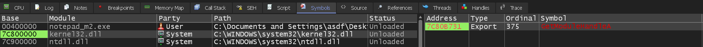


Resume the process and the breakpoint will hit. Keep an eye on the return value on top of the stack, this indicates who the caller is. Keep resuming the process until the caller of GetModuleHandleA is from a memory region owned by the process.

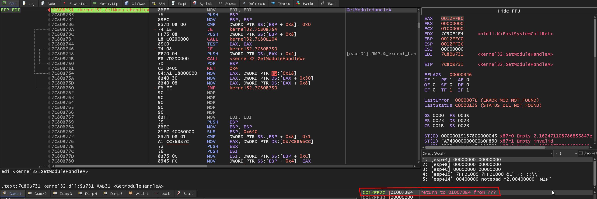


Once the return address leads to a memory region that is owned by the process that's being debugged, then the Original Entry Point (OEP) can be found by using *Execute until return*.

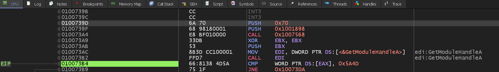


Now with the OEP found, Scylla can be used to dump and restore the import address table.

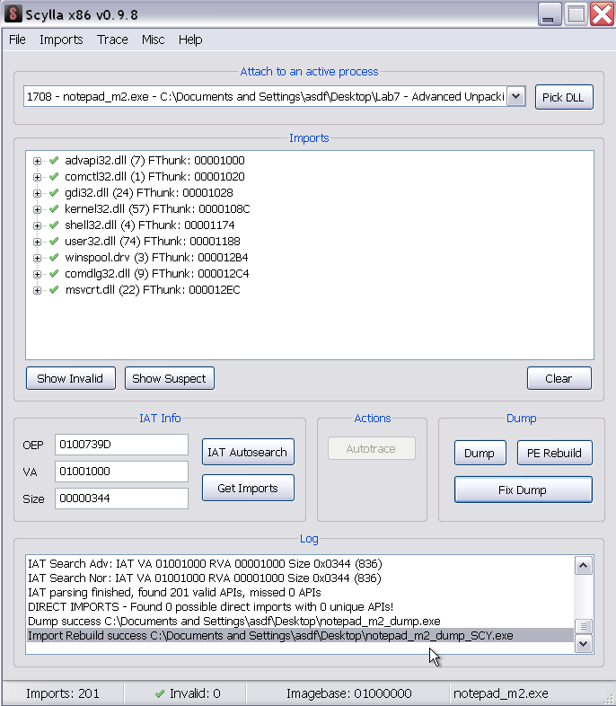

Notepad runs!

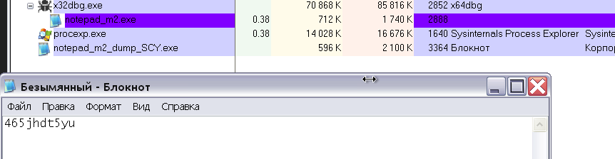


## 2. In Depth: Decryption

Morphine stores the original executable as cipher text, and it relies on a combination of `XOR`, additions, rotations, subtractions, etc to decrypt it. Morphine uses the same decryption routine for all parts of the application (PE Headers, sections, etc).

Assuming the debugger has loaded the debugged target at its preferred image base, then the decryption of Notepad begins at `0x4011B7`.

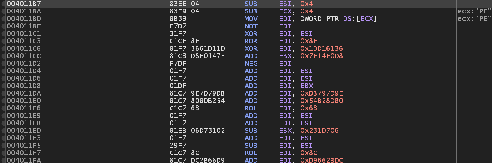

In the image below the unpacker has begun decrypting Notepad's DOS header. Morphine does this in `DWORD` chunks and in reverse, starting from the magic bytes `0x50 0x45`. These magic values are *PE* in ascii and indicates the start of the NT Headers (the headers that follow the initial DOS header).

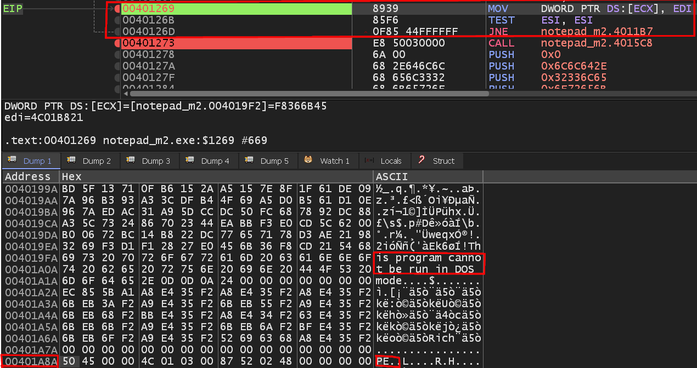

The decryption routines loop count is stored in `ESI` and is the offset to the NT Headers. The decrypted `DWORD` is stored in `EDI` and the write location of that `DWORD` is stored in `ECX`.

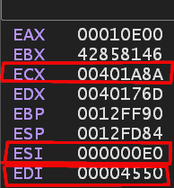


The NT header in Notepad starts at an offset 0xE0.

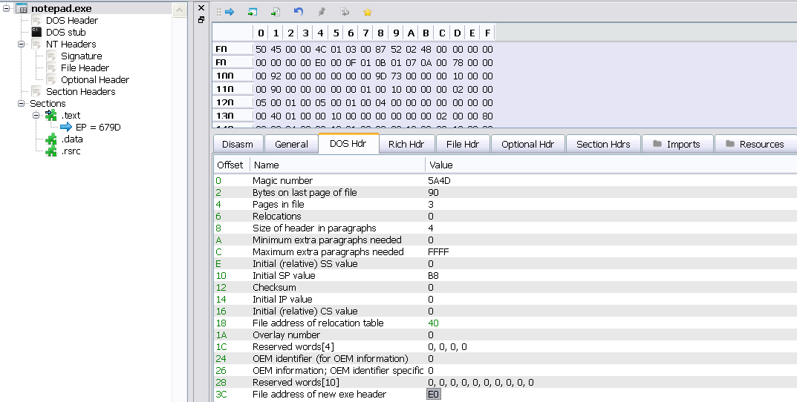


## 3. In Depth: Import Restoration Code

The import restoration can be found by breaking on `LoadLibraryA` and using *Execute until return* to return to the caller.

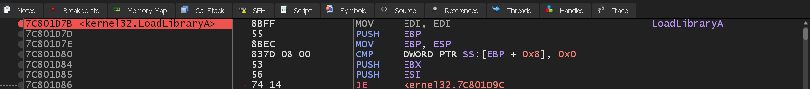

`LoadLibraryA` expects a `const char*` as its only parameter. The unpacker pushes the the string as `DWORD` chunks onto the stack (including the null terminator). Then it uses the memory address stored in `ESP` (which will correctly point to the first character of the string) as the function argument.

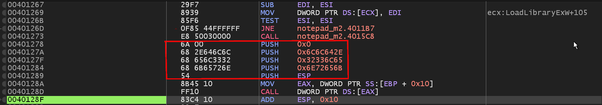

Transforming each hex value into ASCII while taking little endian into account reveals that Morphin is attempting to load `kernel32.dll`.

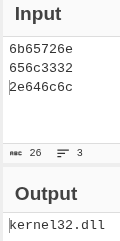

### 3.1 GetProcAddress

The individual functions that are resolved can be found in the same manner. Place a breakpoint on `GetProcAddress` and then *Execute until return*.

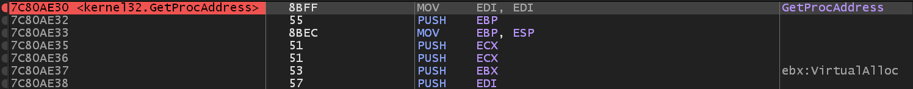

Once the `EIP` is back at the caller the same kind of string obfuscation is visible. Morphine pushes string fragments onto the stack.

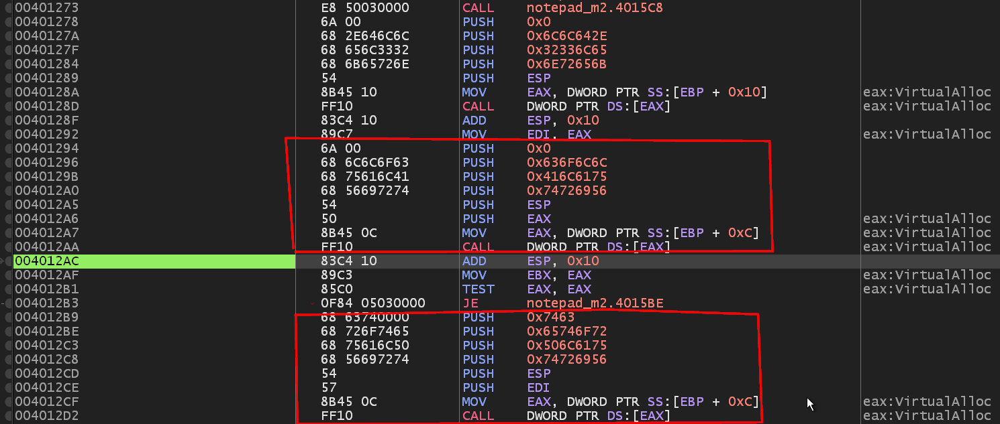

The string highlighted in the previous image turns out to be `VirtualAlloc` and `VirtualProtect`.

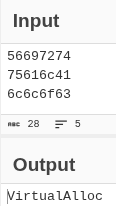

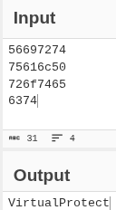


### 3.2 Loading Notepad

Morphin calls `VirtualAlloc`, and by confirming its function declaration:

````c++
    LPVOID VirtualAlloc(
        [in, optional] LPVOID lpAddress,
        [in]           SIZE_T dwSize,
        [in]           DWORD  flAllocationType,
        [in]           DWORD  flProtect
    );
````

It is possible to deduce that morphin uses `VirtualAlloc` to allocate `0x14000` bytes at adress `0x1000000`. 

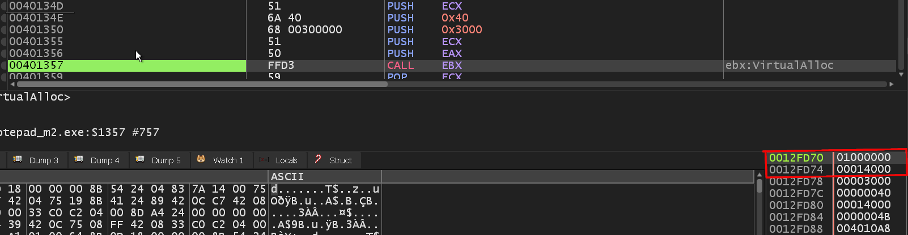

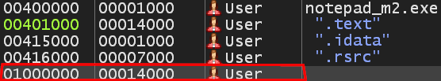

These values coincide with Notepad's real ImageBase and ImageSize.

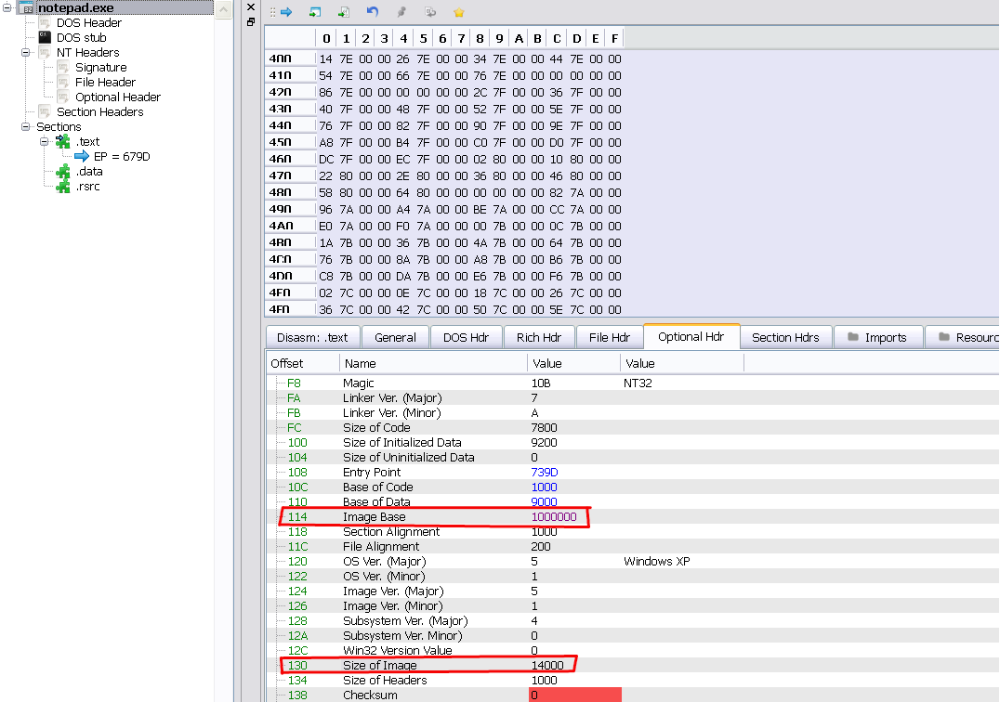

Morphin copies Notepad's PE header to the new memory region using `REP MOVSB` (REPEAT MOVE STRING BYTE) instruction.

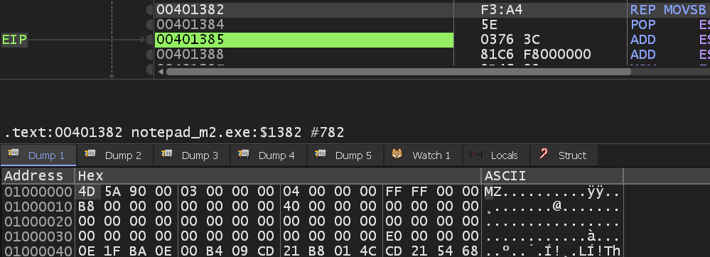

Once the PE header has been copied, Morphin copies Notepad's `.text` section using `REP MOVSB` instruction. The figure below covers all of Notepad's sections (`.text`, `.rsrc` and `.data`). Its done in a loop on addr `0x4013BE`. The number of sections that the packed executable has is stored in `EAX`. The raw size (size on disk) of the section being copied is stored in `ECX`.

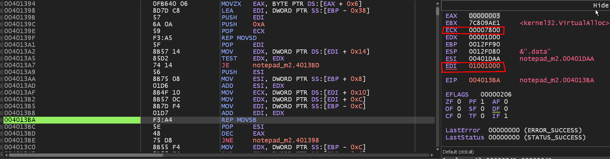

The original `.text` section of Notepad is located at Image Base + `0x1000` when in memory (assuming no ASLR). PEBear provides its own hexdump of the original `.text` section, which can be seen in the image below.

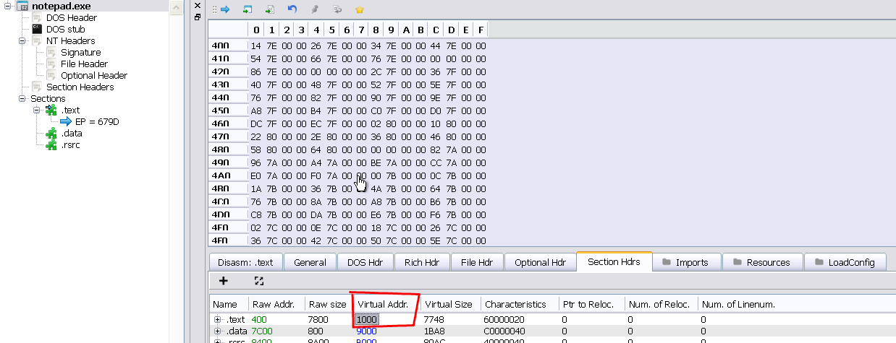

Inspecting the new memory region at an offset of `0x1000`, its possible to see that the byte values align. Therefore, it is safe to say that Notepad's `.text` section has been copied to the new memory region.

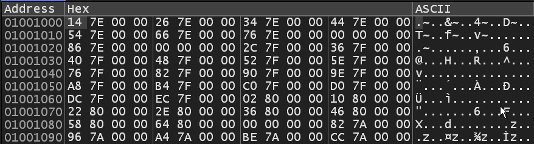

Notepad is now decrypted and mapped to memory. The next steps for Morphin is to loop over the needed import functions and obtain their function pointers by calling `GetProcAddress`.

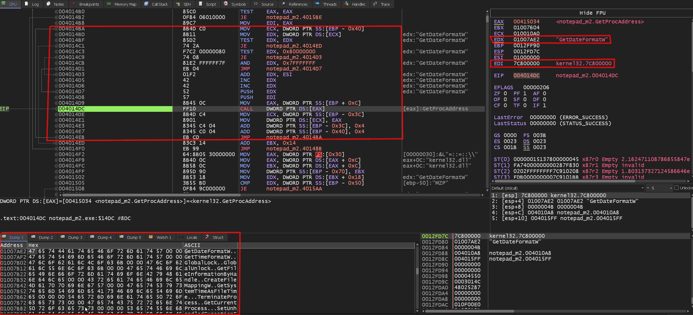