# FRA Reverse Engineering Challenge

---


## Abstract

The Swedish government agency FRA (National Defence Radio Establishment in English) has multiple CTF style challenges on their website. Challenges that either have been used or are used during recruiting [1]. Many are related to analysing network traffic, but they do have one dedicated reverse engineering challenge. That challenge is a 32-bit Windows crackme, and its solution is presented here.


## Table of Contents

- [1. Executing the Crackme](#1-executing-the-crackme)
- [2. Analysis](#2-analysis)
	- [2.1 Unpacking](#21-unpacking)
        - [2.1.1 Anti-Debug PEB Check](#211-anti-debug-peb-check)
        - [2.1.2 XOR Decoding Mapped Sections](#212-xor-decoding-mapped-sections)
        - [2.1.3 Tail Jump?](#213-tail-jump?)
		- [2.1.4 Anti-VM Bypass](#214-anti-vm-bypass)
		- [2.1.5 Dumping the Process](#215-dumping-the-process)
		- [2.1.6 Fixing the PE File](#216-fixing-the-pe-file)
    - [2.2 Static Analysis](#22-static-analysis)
        - [2.2.1 The Application Loop](#221-the-application-loop)
        - [2.2.2 Initial Encoding](#222-initial-encoding)
		- [2.2.3 Initial Encoding: The Second Stage](#223-initial-encoding-the-second-stage)
		- [2.2.4 Brute Forcing the Key](#224-brute-forcing-the-key)
		- [2.2.5 Division by Zero Dispatch](#225-division-by-zero-dispatch)
		- [2.2.6 Access Violation Dispatch](#226-access-violation-dispatch)
		- [2.2.7 Patching the Breakpoint Redirect](#227-patching-the-breakpoint-redirect)
		- [2.2.8 Notepad is Launched](#228-notepad-is-launched)
- [3. Keygen](#3-keygen)
- [4. Solution](#4-solution)
- [References](#references)


## 1. Executing the Crackme

Launching the executable launches a GUI application that accepts limited input. The expected input is likely the flag.


Interestingly, the crackme has its own child process but it is the parent that contains `bcryptprimitives.dll` and `cryptbase.dll`. 

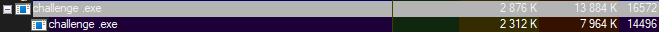

Its possible to attach the debugger to the child process, but when attempting to attach it to the parent it fails because the process is already being debugged. This is an anti-debug technique that is fairly well documented. The basic idea is that the original binary calls `CreateProcessA` to launch a new process. This could be a new executable or re-launch itself and then branch based on provided command line arguments. 

The child process will attempt to open a handle to the parent process, and if successful, call `DebugActiveProcess`. The child then has its own application loop that repeatedly calls `WaitForDebugEvent` and `ContinueDebugEvent`.

This likely means that the child process is just an anti-debug helper, and the key check lies in the parent. The next step is therefore to first focus on the parent, which is the main executable.

## 2. Analysis

Inspecting the crackme in PE-Bear immediately highlights that its very likely that this binary is packed. The executable is clearly missing expected sections such as `.data` and `.rdata`. In their place there are three sections called `%*s%*s%s`, two of which have execute permissions.

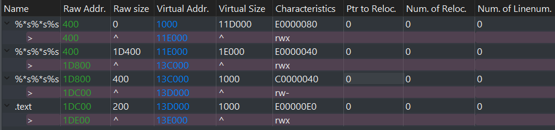

### 2.1 Unpacking

If the crackme is opened and ran in the debugger than it immediately crashes. The crash happens because the `EIP` points to garbage. Considering one anti-debug technique has already been identified, its likely that there are more. The first prevented attaching a debugger, the code itself likely has anti-debug that prevents launching it from a debugger as well.

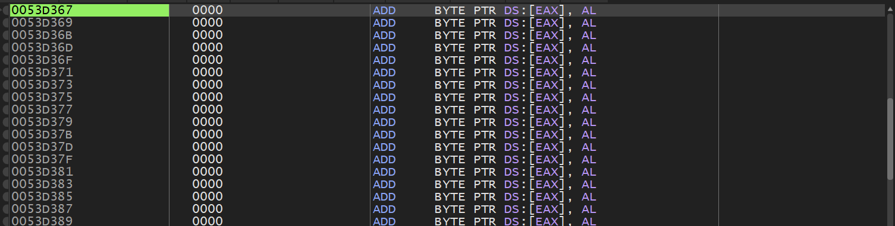


#### 2.1.1 Anti-Debug PEB Check

Re-launching the crackme inside the debugger and manually stepping a handful of instructions reveals another anti-debug technique instantly. The packer reads the `BeingDebugged` member of the PEB, that has the offset `0x02` [2]. It access the PEB by first obtaining the memory address of the TEB with the help of `FS:[0x18]`. The TEB holds the pointer to the PEB as a member with an offset of `0x30` [3].

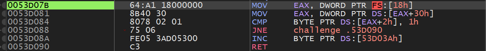

If a debugger is detected then it increments some value at `0x53D03A`. Likely some global variable that it uses later to check if a debugger has been detected. For now, the easiest way is to simply patch it out with `NOP` so that this individual check does not mutate the programs state.

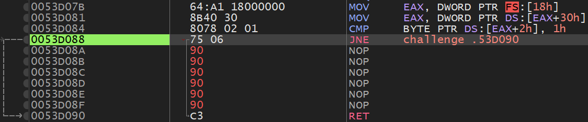


#### 2.1.2 XOR Decoding Mapped Sections


Continuing with the manual single stepping after patching the anti-debug check very quickly leads to code that looks like an `XOR` decoding loop. The loop counter is stored in `ECX`, starts at zero and is incremented by one each iteration. The loop condition is checked on address `0x53D0A0`, and shows that it will do `0x13B000` iterations. The interesting thing to note about this loop is the `PUSH` and `RET` pattern to start the next loop iteration.

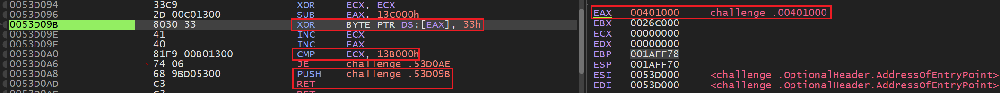

The address held in `EAX` is a very familiar base image address, and is the start address of one of the three sections that had their names scrambled. Simply calculating `0x401000 + 0x13B000` gives a sum of `0x53C000`. This just so happens to be the start address of the `.text section`. This loop therefore `XOR` decodes the three sections other sections.

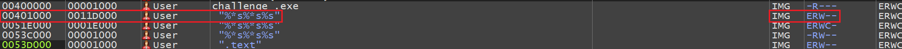


Opening up the original executable in IDA reveals very little. This is expected considering the packer. However, the `XOR` decryption can be applied using IDA Python and if that is done then a lot more code is revealed.


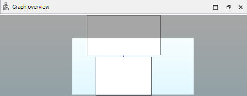


````python
import ida_bytes
import idc

eaStart = 0x53b080
eaEnd = 0x53C000

for ea in range(eaStart, eaEnd):
 b = ida_bytes.get_byte(ea)
 b ^= 0x33
 ok = ida_bytes.patch_byte(ea, b)
 if (not ok):
  print("failed to patch bytes at ea: {}".format(hex(ea)))
````


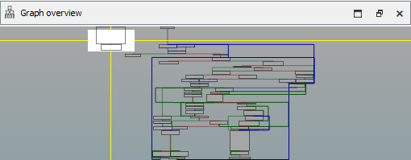


Note that the script does not `XOR` the full range because it would result in a lot of incorrect values. IDA cannot actually know what the values are in the first section that starts at `0x401000`. Inspecting the PE header again in PE-Bear shows that specific section has no data stored on disk, only that it should have a large chunk (`0x11D000`) of memory allocated at runtime.

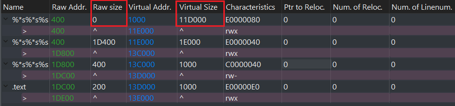


#### 2.1.3 Tail Jump?


The interesting part about these new code blocks that appeared after having been decoded, are that it contains what looks like a tail jump.

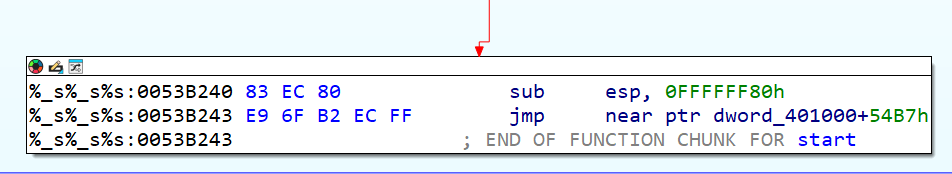

Placing a breakpoint on address `0x53B243` and continuing execution will cause the debugger to intercept an `EXCEPTION_PRIV_INSTRUCTION` exception. The reason  is ´that the program tries to execute an `IN` instruction. `IN` reads input directly from the hardware and requires the operating systems explicit permission when called from user mode, because such hardware access should normally go through the kernel. 

However, the instruction is commonly used in anti-vm techniques because hypervisors tend to intercept the instruction. As a result, the virtual machine can reveal magic values that identifies it. This is exactly what the code is attempting to do. At the time of the execution of the `IN` instruction the value stored in `EAX` is `0x564D5868`, which is `VMXh` in ASCII. A magic value for VMWare.

#### 2.1.4 Anti-VM Bypass

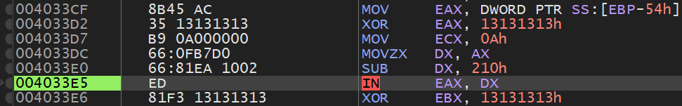

There is a lot about the surrounding code that is interesting for varying reasons. For example, x86dbg shows that before executing `IN` the code called resolved the address to the Win32 function `OutputDebugStringA`. The code is also accessing the `IsBeingDebugged` field in the PEB again. This code is likely a collection of anti-debug and anti-vm techniques.

To start, the `IN` instruction can be patched by a single `NOP`, then followed by placing a hardware execution breakpoint on the call to `OutputDebugStringA` just before it.

Rerunning the program will then reveal that `OutputDebugStringA` is called with `%s%s%s%s%s%s%s%s`. This is an anti-debug technique directed against OllyDbg that causes it to crash. However, x86dbg is not affected by this bug so its safe to ignore unless you run OllyDbg.

The code then accesses `IsBeingDebugged` in the PEB again. What it does is a conditional assignment. If the process is being debugged then it stores `0xD`, if the process is not being debugged then it stores `0xC`. From this code alone it is not clear what the purpose is. Therefore, its a good idea to place a hardware access breakpoint on the memory address of `IsBeingDebugged`.

Next up is the `IN` instruction to check if the program is running in VMWare. If the progam is running in VMWare, then the code `XOR` the meme value BAADCODE (0xBAADC0DE) with some memory address. The code likely sets some global state depending on whether it identified a VM or not. Interestingly, there is another such meme value (BAADIDEA) being `XOR` to the same memory address further down.


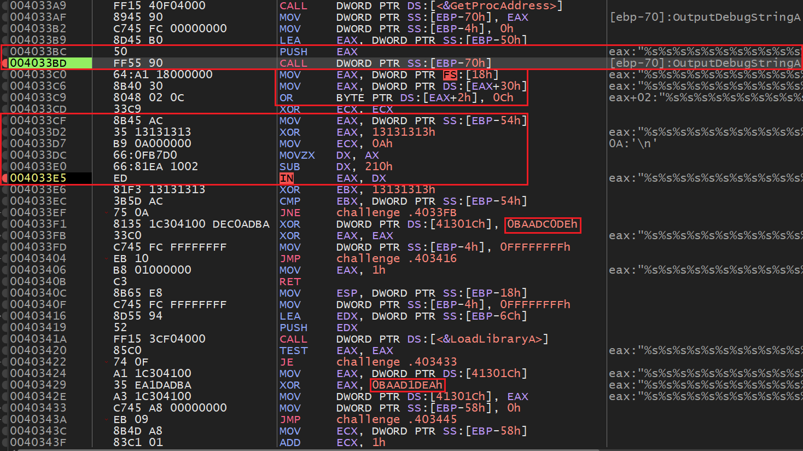

By single stepping in the debugger it becomes clear that the code attempts to load the DLL `VBoxHook.dll`. This DLL is clearly related to VirtualBox, and might be installed along side VirtualBox Guest additions [4]. Thus, this is another anti-vm check. 

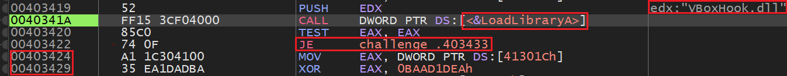

The simplest solution to these anti-vm checks is likely to `NOP` the branch that triggers from a successful vm identification.

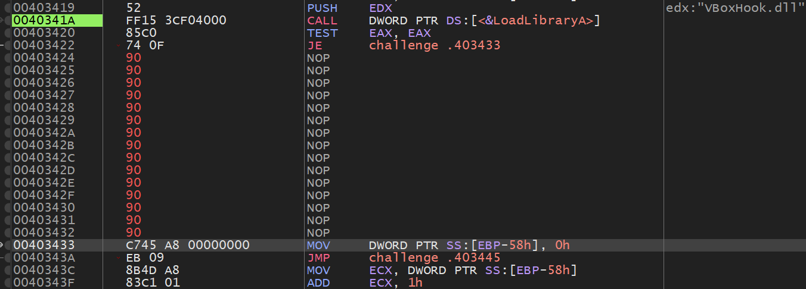


#### 2.1.5 Dumping the Process

Continuing executing the program after patching the anti-vm checks will trigger the breakpoint on the tail jump. The access breakpoint set on the `IsBeingDebugged` field is never hit, so the reason it was assigned a value will remain a mystery for now. Scylla can successfully dump and restore the IAT for the address that the tail jump targets. 

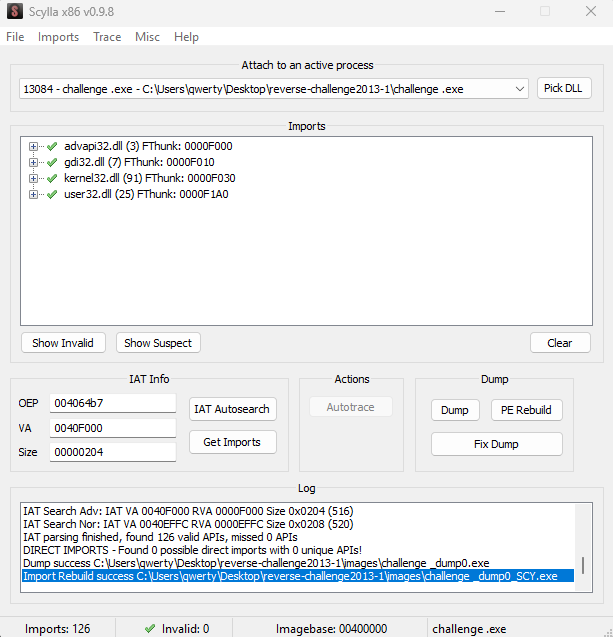

By opening the dumped file in IDA, its auto analysis successfully identifies `start`as the function that was called by the suspected tail jump. The tailjump is thus confirmed as leading to the OEP. However, if the file is executed it will crash in the CRT initialisation code. Specifically, the crash occurs inside a call to `InterlockedIncrement`.

#### 2.1.6 Fixing the Dumped File

The CRT initialisation code is fairly small, therefore the path taken through its CFG during runtime can be traced manually and cross compared to the packed variant. If this is done then it becomes clear that the path diverges at three locations. All three divergences happen when reading some value at an absolute address. This likely means that there is data in the `.data` or `.rdata` sections that has been carried over from the dumped process. Therefore, these values has to be patched manually.

The first divergence happens inside `___security_init_cookie`. This appears to be a default value that decides whether or not the security cookie should be initialised. The value is loaded from the absolute address `0x4169E8` into `EAX` and is expected to be `0xBB40E64E`. 


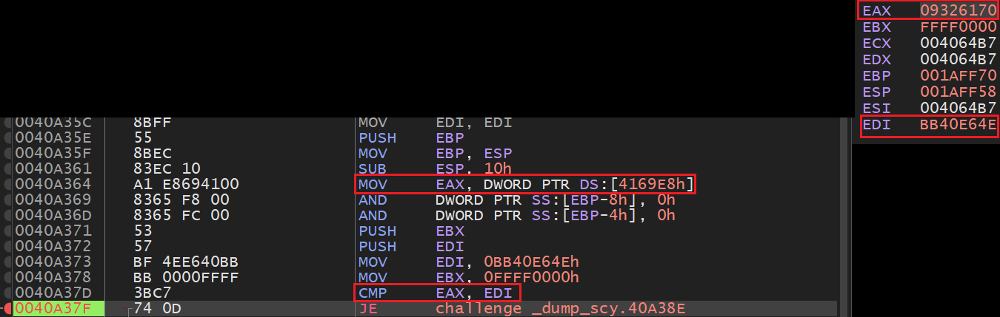

The easiest solution is to patch the value at `0x4169E8` in a hex editor. The file offset can be calculated with `RawAddress + 0x4169E8 - ImageBase - VirtualAddress`. The `ImageBase` value can be found in the `OptionalHeader` and is `0x400000`. The section offset values (`RawAddress` and `VirtualAddress`) can be found in the `SectionHeader` and are `0x400` and `0x1000`.

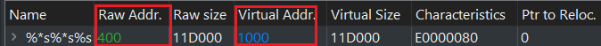

The file offset is therefore: `0x400 + 0x4169E8 - 0x400000 - 0x1000 = 0x15DE8`. This is where the `DWORD` `0xBB40E64E` should be inserted (as little endian).

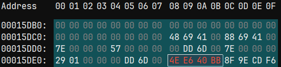


There are two more patches that must be applied to fix the remaining two path divergences. The first is a byte at file offset `0x1837C` that should be set to `0`. The second is another `DWORD` at file offset: `0x159E8`. The value should be changed from `0x02881BE8` to `0x004161C0`.

After applying those three patches the unpacked crackme runs!


IDA complains that some imports may be missing, therefore the file may not be 100% accurate. However, because IDA recognises `WinMain` it is enough for static analysis.

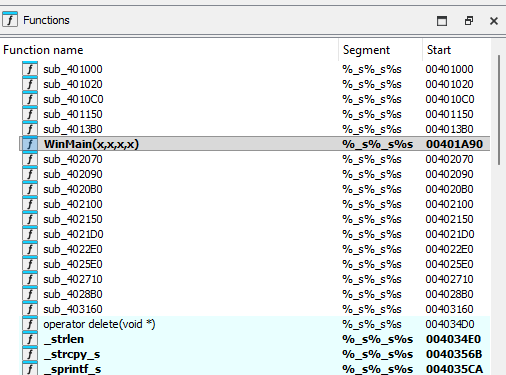


### 2.2 Static Analysis

The first thing that `WinMain` does is to collect a timestamp. For now, just know that this timestamp will become important later.

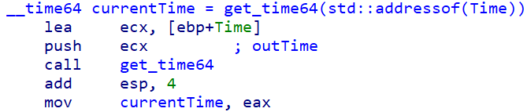


#### 2.2.1 The Application Loop


The program uses `WinMain` and the traditional Win32 input handling through  `GetMessageA`, `SendMessageA`, `TranslateMessage` etc. This loop contains calls to `GetAsyncKeyState` to check for two types of key presses, `Enter` and `ESC`. The interesting check relates to the former. If `Enter` is pressed, then the program will issue a message code `0x8001`. Codes that are in the range `(0x8000, 0xBFFF)` are reserved for custom messages in Win32. This message ID is likely to lead to relevant code, considering that `Enter` is used to submit the user input when running the crackme.

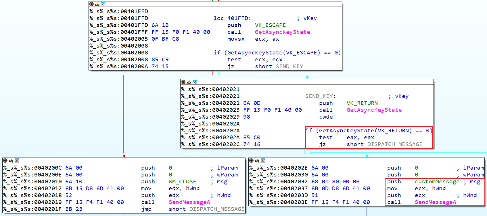

The code just before the application loop is related to initialising the window. Among the code a call to `RegisterClassExA` is made, which takes a function pointer to a callback that will be called on events made to that window.

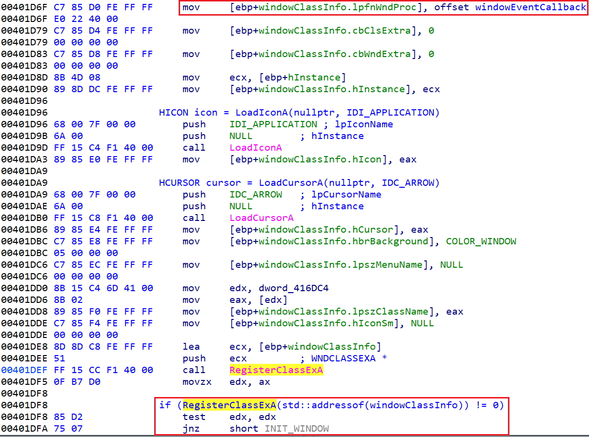

This function will immediately branch on the window message code. Tracing the control flow quickly leads to the branch that handles the custom message.

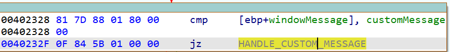

The code that handles the custom message does an initial length check. Thus the key has to be greater than 22 characters, otherwise the encoding function will not be called.

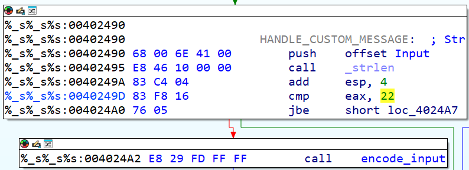

#### 2.2.2 Initial Encoding

The actual encoding algorithm is a `XOR` table encoding. It will take the sum of an individual character in the key and the current loop iteration. This sum is then used as an index, to extract the actual `XOR` key from a second table. That key is then `XOR` with the character used to obtain its index. 

One important finding that is not shown in the figure below is that the encoding algorithm only loops over the 21 first characters of the provided input. In combination with the length check that happens before this encoding function is called, it means that there are at least two parts to the expected key.


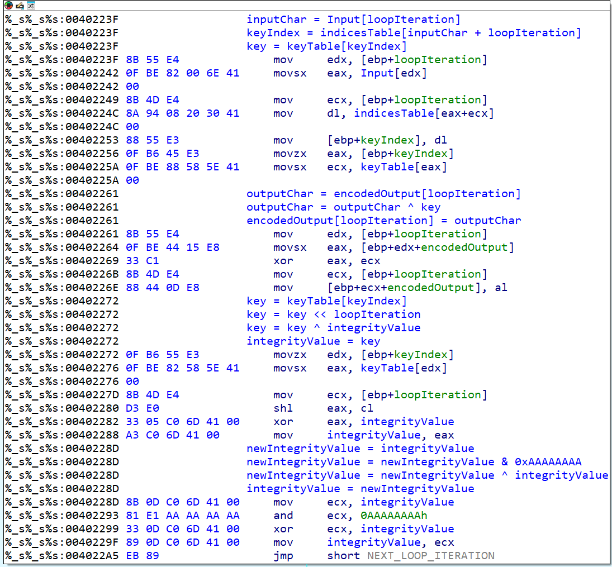

There is a secondary part to this encoding algorithm, and that is the integrity value. This value does not directly affect the encoding of the key or the following key check, but rather serve as a secondary stage. 

The integrity value is a local variable and only accessed within the encoding function. This can be confirmed with the help of IDA's cross references.

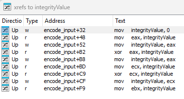


After the key has been encoded it it compared directly to the expected result using `memcmp`.The expected output are raw bytes and not printable ASCII.
Expected output `0x20 0x2D 0x07 0x28 0x30 0x24 0x10 0x27 0x2E 0x1D 0x2E 0x20 0x09 0x18 0x24 0x06 0x3E 0x17 0x32 0x21 0x12`

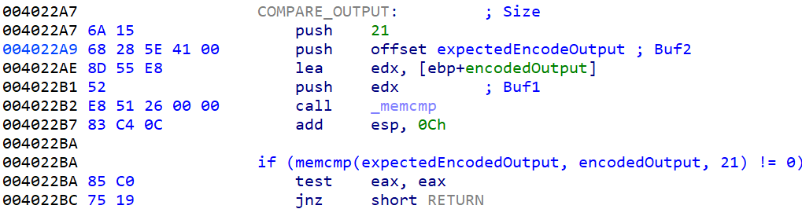


#### 2.2.3 Initial Encoding: The Second Stage

As mentioned, there is a second stage to the encoding algorithm. The integrity value is compared (sort of) to a cookie value. If the xrefs are inspected for the cookie value it becomes clear that the cookie is written to in several places. One write that immediately sticks out is the `XOR cookie, 0xBAADC0DE` from the previously analysed anti-vm code. Thus, this is likely a global variable that is expected to have a specific value and is intentionally mutated if the program detects analysis attempts. 

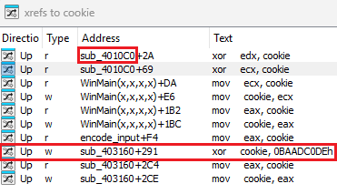

The read xref that happens in `sub_4010C0` is interesting, because this subroutine is never called directly and instead is written to the EIP by the debugger child process.

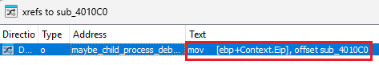

More specifically, it is written when a division by zero exception occurs that are not handled by the main program. The debugger in the child serve as a type of dispatcher. The parent triggers an exception or breakpoint that is caught by the debugger child, the child handles the fault by redirecting execution.

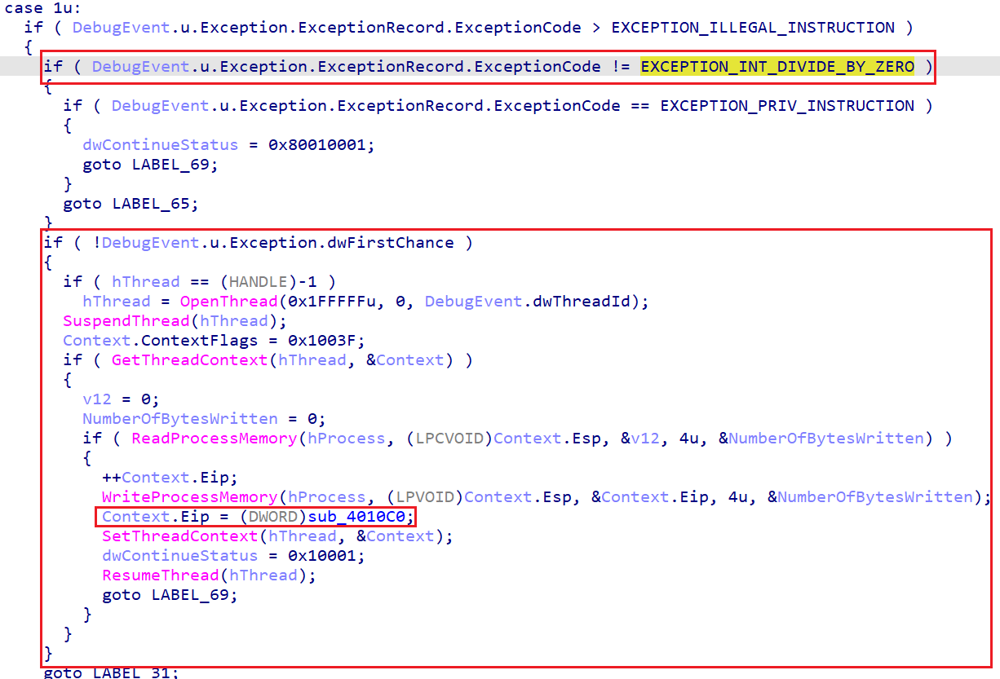

This is the second stage of the encoding algorithm. It checks that the produced integrity value matches the expected cookie so that `EBX` becomes zero to cause a division by zero exception and hand over execution to the child's dispatcher.

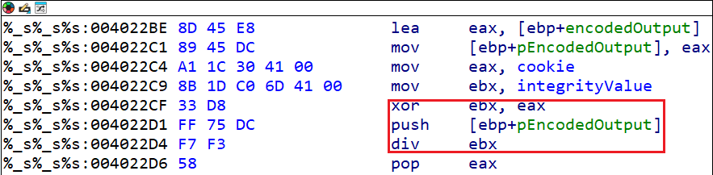

####  2.2.4 Brute Forcing the Key

The integrity value is produced as a byproduct of the key, and the key is checked directly to a specific byte sequence, therefore if the key is correct the integrity value should be correct. Thus, the second stage should pass automatically as long as the cookie value has not been modified by any anti-vm/debug checks.

The key itself can be brute forced quite easily because its a trivial `XOR` encoding without chaining. Plainly said, each character is independent and can therefore be solved on their own. 


````python
def is_match(expectedEncodedChar: int, inputChar: int, loopIteration: int) -> bool:
    keyIndex = indicesTable[inputChar + loopIteration] & 0xFF
    key = keyTable[keyIndex] & 0xFF

    encodedChar = (encodedOutput[loopIteration] ^ key) & 0xFF

    return encodedChar == (expectedEncodedChar & 0xFF)

def possible_matches(expectedEncodedChar: int, loopIteration: int):
    return [
        c for c in range(0x20, 0x7F)
        if is_match(expectedEncodedChar, c, loopIteration)
    ]


indicesTable = bytes.fromhex("""
    00 0D 01 06 02 03 1E 1B 0D 0B 06 04 0C 15 0E 05
    11 0E 14 0E 01 19 0A 08 16 14 18 1F 09 1B 17 06
    1F 1B 1C 19 1A 15 1B 0F 03 08 05 01 14 05 00 14
    10 01 15 14 10 0F 03 13 1F 00 0A 01 1A 13 14 08
    1B 03 06 1B 02 10 0D 1E 1A 04 09 18 19 14 0E 1A
    1A 0A 19 03 1D 04 12 13 00 1A 1D 16 18 0D 0E 15
    17 13 05 10 0C 09 05 1D 07 17 07 0E 11 11 06 00
    1D 06 02 00 05 00 04 01 1D 0D 1F 06 05 0B 0D 18
    09 1D 15 1F 1D 1C 08 0A 19 1C 06 0A 08 10 0C 14
    1A 1B 05 14 17 12 17 1C 0B 05 12 19 14 12 0F 00
    1D 18 05 13 10 08 11 04 0D 13 02 19 1A 0A 15 05
    05 11 0A 0D 15 09 00 07 13 13 0C 00 0E 0C 03 00
    11 1D 17 1D 10 10 0C 10 19 1F 0D 0C 1B 19 0D 0A
    07 15 0F 1D 17 1A 07 06 14 0E 18 0C 0F 08 0E 0F
    18 0A 03 10 1F 19 1C 15 03 06 09 17 10 1D 12 1A
    1C 15 05 18 09 1E 06 04 1F 0D 12 14 08 16 09 00
""")

keyTable = bytes.fromhex("""
    59 62 46 65 66 57 67 4D 
    68 69 53 54 6D 6C 52 49 6E 6F 4F 70 73 74 42 75
    77 55 41 61 43 44 51 64  63 48 45 78 79 4A 76 52
    56 7A 4C 71 4E 4B 72 50  47 6B 58 5A 6A 00 00 00
""")


expectedEncodedOutput = bytes.fromhex("""
20 2D 07 28 30 24 10 27 2E 1D 2E 20 09 18 24 06 3E 17 32 21 12
""")
encodedOutput = b"ABCDEFGHIJKLMOPQRSTUV"

matches = []
for i in range(0, 21):
    expectedChar = expectedEncodedOutput[i]
    matches.append(possible_matches(expectedChar, i))


print("All possible character inputs:")
for i in range(0, len(matches)):
    print(f" {i:02X} ", end = "")

row = 0
for i in range(0, len(matches)):
    print("\n")
    for col in range(0, len(matches)):
        if len(matches[col]) > row:
            val = matches[col][row]
            print(f"  {chr(val)} ", end = "")
        else:
            print("    ", end = "")
        
    row += 1
````

If the code above is run then it becomes apparent that the first stage accepts multiple keys. However, one combination of characters sticks out: `ClevernessIsNotWisdow`. This is likely the first part of the key.


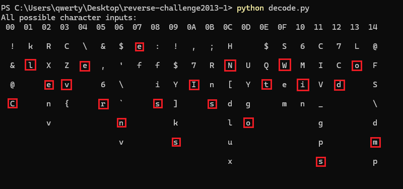


#### 2.2.5 Division by Zero Dispatch

The subroutine that the child process redirects to is responsible for calling another function. This function however is encoded in memory by default, so before that call is made it is decoded using yet another `XOR` encoding. This is similar to what the packer did to decode its unpacking stub. This time the key is four bytes instead of one, and the key itself is the cookie value. 


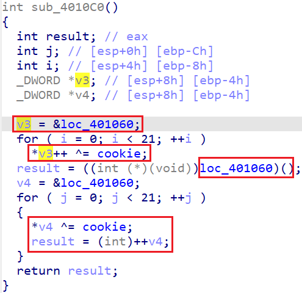

The code is mostly nonsense in IDA. As is to be expected because it is encoded. To understand what this code does it has to be decoded, which can be done in IDA. However, the correct cookie value is first required.

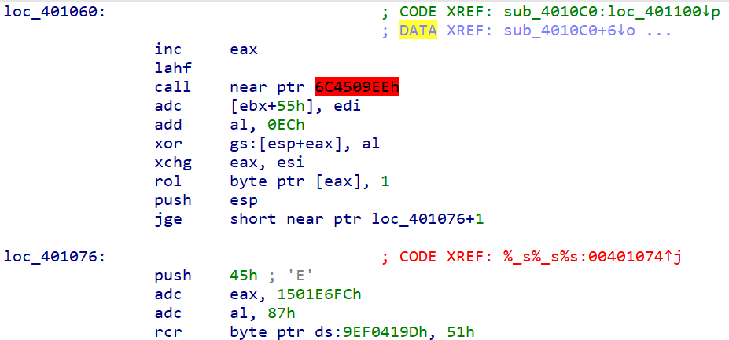

If the crackme is run then the initial value of cookie is `0x9A9A8A8B`. Looking back at the cross references shows that there are in total four writes:

> XOR cookie, 0x9E9E9E9E

> XOR cookie, 0x12345678

> XOR cookie, 0xBAADC0DE

> XOR cookie, 0xBAAD1DEA

Xor is symmetric so this gives a maximum of 2<sup>4</sup> = 16 results. These 16 results can be reduced further because the encoding algorithm used the `AND` operator on the integrity value with the a constant (`0xAAAAAAAA`). Thus, the cookie result must not be mutated if it is AND'ed with the same constant.

````python
from itertools import combinations

g_cookie = 0x9A9A8A8B

xors = [
    0x9E9E9E9E,
    0x12345678,
    0xBAADC0DE,
    0xBAAD1DEA,
]

mask = 0xAAAAAAAA

results = set()

for count in range(len(xors) + 1):
    for selected in combinations(xors, count):
        cookie = g_cookie

        for value in selected:
            cookie ^= value

        results.add(cookie)

for cookie in sorted(results):
    valid = (cookie & mask) == 0
    if valid:
        print(f"0x{cookie:08X}")
````

> Output: 0x04041415


With the cookie known the function can be decoded with the help of IDA Python.


````python
import ida_bytes


ea = 0x401060
eaEnd = ea + (21 * 4)
key = 0x04041415

for ea in range(ea, eaEnd, 4):
    value = ida_bytes.get_dword(ea)
    value = value ^ key
    if not ida_bytes.patch_dword(ea, value):
        print(f"Patching failed at {ea}")
````


The cookie value appears to be correct, because after decoding the subroutine is valid assembly. The address `0x416E15` is important because it is actually the address of the 22nd character in the provided input. The input buffer starting at `0x416E00`. This means that the decoded subroutine is responsible for interacting with the second part of the key.

This second part is given as an argument to a function that is likely a base64 decoder. The function itself is fairly large with many basic blocks and multiple loops, but there are two key facts that point toward it being base64. First, the string `ABCDEFGHIJKLMNOPQRSTUVWXYZabcdefghijklmnopqrstuvwxyz0123456789+/` is loaded. Second, the decompiler shows a bit-combination commonly seen in base64 decoding. Converting 6-bit values into 8-bit values.

What follows after the base64 decoding is also very revealing. First, the full input string is pushed to the stack. This is followed by subtracting the four first bytes of the second part of the key with the current time. The result of this subtraction is then de-referenced. It is unlikely that this is a legitimate dereference considering that the register is immediately over written by the following `POP` instruction. What is more likely is that this is an intentional `nullptr` dereference as to trigger another exception. 

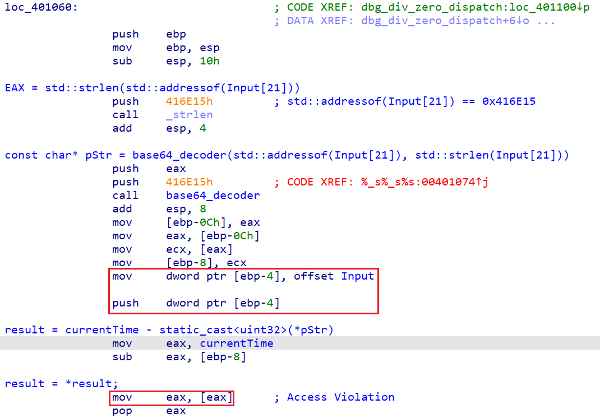

#### 2.2.6 Access Violation Dispatch

Inspecting the code body of the child process then such a case does exist. What is interesting here is the initial if statement that checks to make sure that the value in `EAX` is zero. This proves that the `SUB` instruction is really a `CMP` and that the code checks to confirm that the base64 decoded value is the current time. What was decoded was the second part of the key, which means that the second part of the key should be the current time value encoded as base 64.


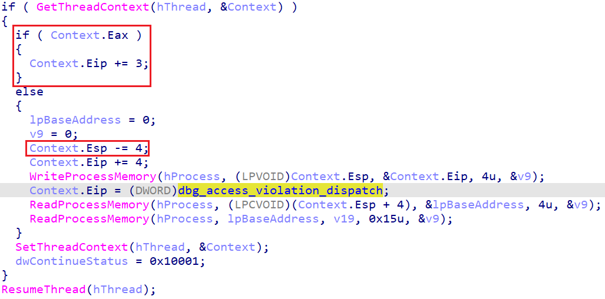

The function itself that the child redirects execution to accesses the full input as an argument. 

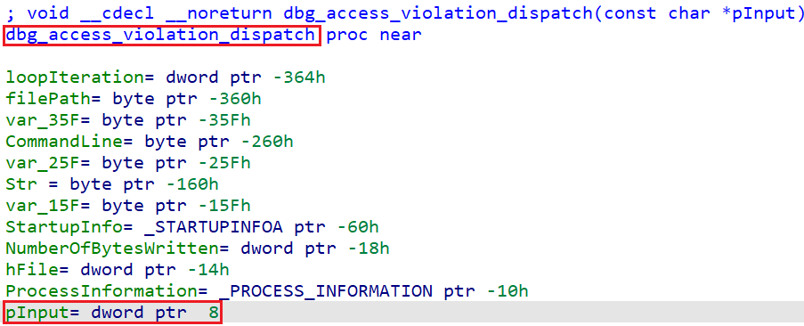

That function has yet another `XOR` decoding algorithm inside. This time it loops over a chunk of memory and uses the first part of the key as a 21 character `XOR` key. This means that even though the python script that brute forced multiple possible inputs, its likely that only one is correct.

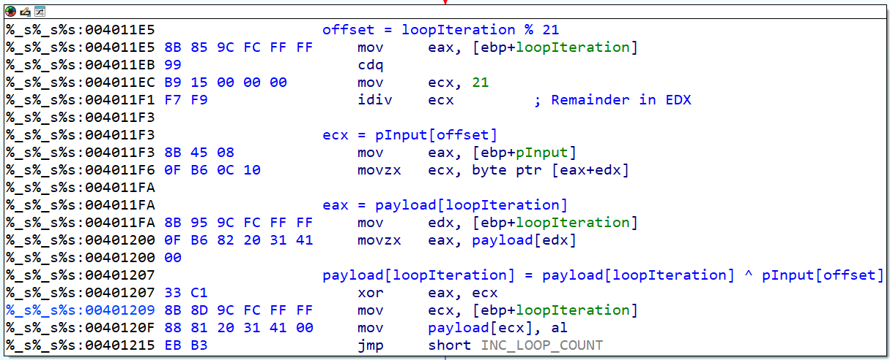

Once the payload has been decoded the function creates a file called `congrats.txt` in the current directory. The string `\\congrats.txt` exists as an encoded string in a string table, and the program uses a software breakpoint (`INT 3`) to pass execution to the child just like it has done with exceptions.

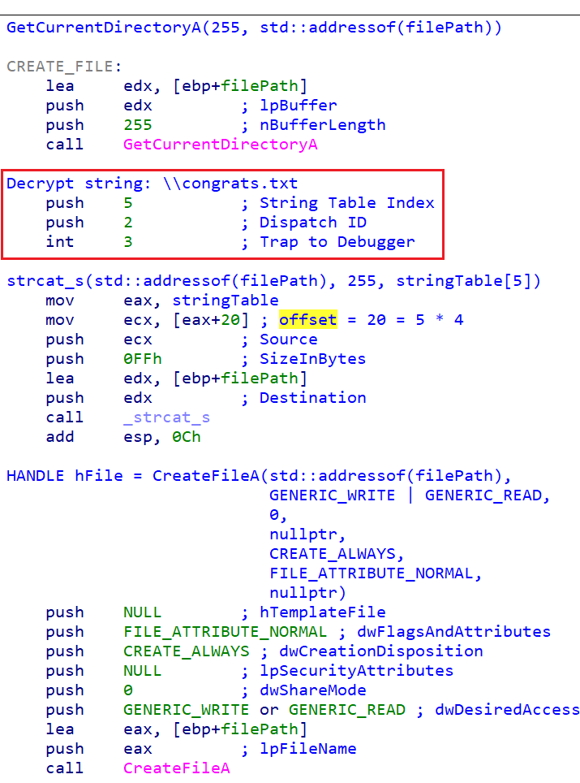

Going back to the child's code it has breakpoint handling which redirects executions just like before.

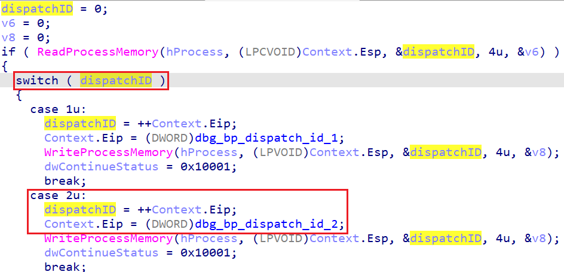

This function takes an index into a table to extract a string and `XOR` decode it using `0x1F`.

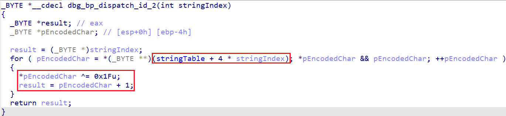

#### 2.2.7 Patching the Breakpoint Redirect

These breakpoint "calls" can be patched to work correctly when executed in x86dbg. Assuming the binary is patched to make it so the child never attaches to begin with.

Luckily the original code uses 5 bytes which just so happens to be the exact amount of bytes required to fit a `call` instruction. The argument does not need to be passed here. The `.text` section that stored the packers code still exist, so there is plenty of executable memory that can be used to write custom assembly. Simply put, the `INT 3` should be replaced by a `CALL` to a region inside the `.text` section that is responsible for pushing the argument to the stack and then calling the function that the child would have redirected execution to. 

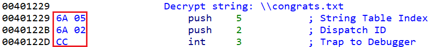

Below is an example of code that can be used to patch this specific `INT 3`. The main takeaway is that all `INT 3` redirects can be patched using type of pattern. Doing so makes it possible to confirm what the decoded string value is by running the crackme under a debugger.


````asm
0x401229:								; Location of the push5; push2; int 3 
		call 0x53D000
	
0x53D000:								; .text section used by the Packer
		push 
		call dbg_bp_dispatch_id_2
		add esp, 4
		ret
````


#### 2.2.8 Notepad is Launched

The decoded payload is then written to the created file, `congrats.txt`. The payload is followed by the base64 encoded current time.

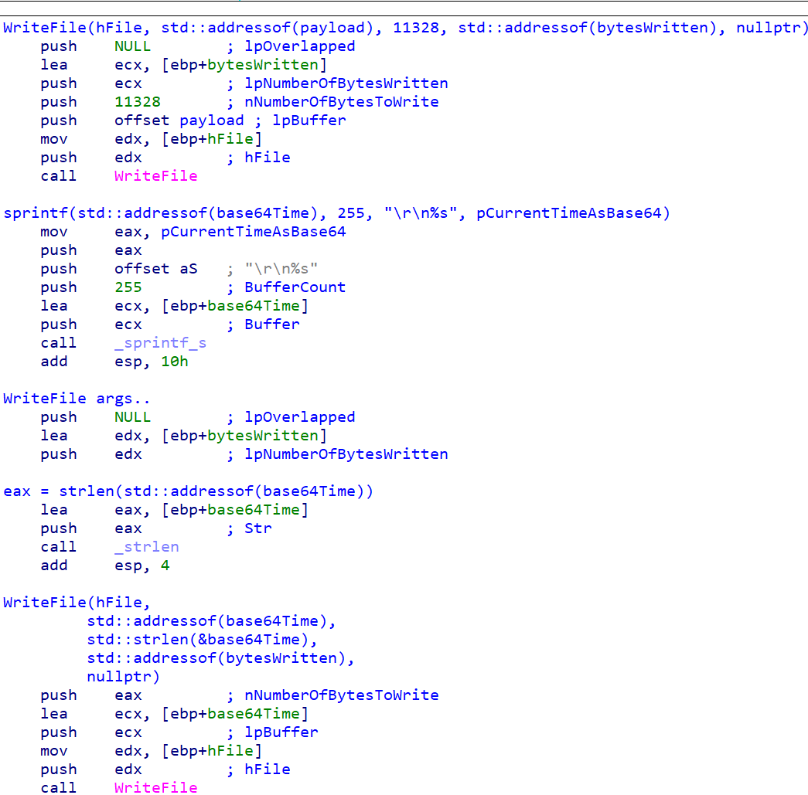

After having written the contents to `congrats.txt`, the crackme builds the string `notepad.exe current\\working\\dir\\congrats.txt`. This is done as a preparation to opening `congrats.txt`.

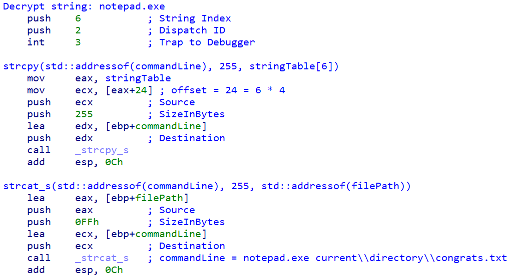

Notepad is then launched, opening `congrats.txt` due to the passed command line argument. 

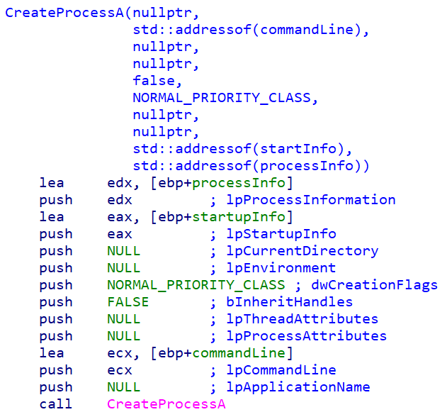


## 3. Keygen

The analysis has made it clear that the key consists of two parts. Part one is a 21 character long string and is likely `ClevernessIsNotWisdom`. The second part is the base64 encoded timestamp. Its not really clear how a user would be able to enter this in a legitimate key/license input considering that the value changes every time you launch the process, but that might be beyond the point.. The important part is the fact that this is a runtime value so you can't know it before hand or brute force it. Therefore, the easiest way to obtain it is simply reading it directly from the process as it is live.

The code below will open a handle to the processes with the PID provided as the first command line argument. Once opened, it will read the base64 value directly and print the full key.

````c++
#define WIN32_LEAN_AND_MEAN 
#include <Windows.h>

#include <vector>
#include <string>


int main(int argc, char** argv)
{
	if (argc < 2)
	{
		return 1;
	}

	std::uint64_t PID = std::stoll(argv[1]);
	HANDLE hProcess = OpenProcess(PROCESS_ALL_ACCESS, false, static_cast<DWORD>(PID));
	if (hProcess == NULL)
	{
		return 2;
	}

	DWORD pCurrentTimeAsBase64{};
	SIZE_T br{};
	if (!ReadProcessMemory(hProcess, reinterpret_cast<void*>(0x00416DC8), std::addressof(pCurrentTimeAsBase64), sizeof(DWORD), std::addressof(br)))
	{
		return 3;
	}
	std::string base64{};
	base64.resize(32);
	if (!ReadProcessMemory(hProcess, reinterpret_cast<void*>(pCurrentTimeAsBase64), base64.data(), base64.size(), std::addressof(br)))
	{
		return 4;
	}

	std::printf("\n\nKey: ClevernessIsNotWisdom%s\n\n", base64.c_str());

	return 0;
}
````


## 4. Solution

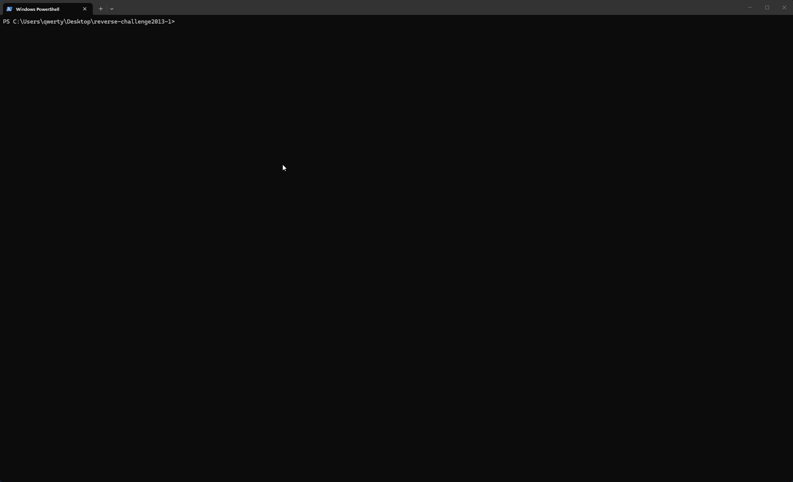


## References

[1] https://challenge.fra.se/

[2] https://www.geoffchappell.com/studies/windows/km/ntoskrnl/inc/api/pebteb/peb/index.htm

[3] https://www.geoffchappell.com/studies/windows/km/ntoskrnl/inc/api/pebteb/teb/index.htm

[4] https://forums.virtualbox.org/viewtopic.php?t=104257